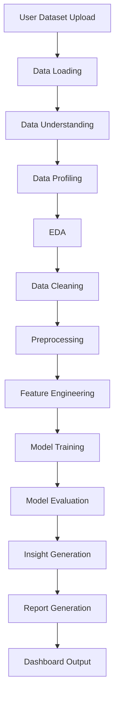

# AutoAnalyst AI

> Automated AI-Powered Data Analyst System


AutoAnalyst AI is a collaborative, beginner-friendly, professional data science project that automates the core workflow of a data analyst: loading raw data, understanding it, profiling it, exploring it, cleaning it, engineering features, training models, evaluating results, generating insights, and presenting reports through a dashboard.

## Problem Statement

Many students and junior data practitioners understand individual tools such as Pandas, Scikit-learn, and Streamlit, but struggle to connect them into a clean, reusable, team-built system. AutoAnalyst AI provides a structured project where a team can learn professional collaboration while building a useful automated analysis pipeline.

## Objectives

- Build a modular Python package for automated data analysis.
- Provide clear starter code for each pipeline stage.
- Train team members on GitHub branches, commits, pull requests, and reviews.
- Create reusable documentation for planning, workflow, roles, and architecture.
- Deliver a basic Streamlit dashboard for dataset upload and quick analysis.

## Key Features

| Area | Starter Capability |
|---|---|
| Data Loading | CSV and Excel loading helpers |
| Data Profiling | Shape, dtypes, missing values, duplicates |
| EDA | Numeric summaries and correlations |
| Cleaning | Duplicate removal and missing-value handling |
| Feature Engineering | Basic datetime feature creation |
| Modeling | Simple classification and regression wrappers |
| Evaluation | Classification and regression metrics |
| Insights | Rule-based insight generation |
| Reporting | Markdown report generation |
| Dashboard | Streamlit upload, preview, statistics |

## End-to-End System Workflow

AutoAnalyst AI is designed as one integrated pipeline. The dashboard and future agent workflows should call the central pipeline instead of duplicating business logic.



Central pipeline file:

```text
src/autoanalyst/pipeline.py
```

See [`docs/end_to_end_integration_strategy.md`](docs/end_to_end_integration_strategy.md) for input/output contracts and team integration rules.

## Folder Structure

```text
AutoAnalyst-AI/
├── app/                    # Streamlit application
├── data/                   # Raw, processed, and sample datasets
├── docs/                   # Planning and collaboration documentation
├── notebooks/              # Exploration and experiment notebooks
├── reports/                # Figures and generated reports
├── src/autoanalyst/        # Main Python package
├── tests/                  # Automated tests
├── .github/                # GitHub templates and workflows
├── README.md
├── requirements.txt
├── pyproject.toml
└── LICENSE
```

## Tech Stack

- Python 3.10+
- Pandas, NumPy
- Scikit-learn
- Matplotlib, Seaborn, Plotly
- Streamlit
- Jupyter Notebook
- Pytest
- Markdown and Mermaid diagrams

## Installation

```bash
git clone https://github.com/<your-org-or-username>/AutoAnalyst-AI.git
cd AutoAnalyst-AI
python -m venv .venv
```

Windows PowerShell:

```powershell
.venv\Scripts\Activate.ps1
pip install -r requirements.txt
pip install -e .
```

Git Bash/macOS/Linux:

```bash
source .venv/bin/activate
pip install -r requirements.txt
pip install -e .
```

## Usage

Run the Streamlit dashboard:

```bash
streamlit run app/streamlit_app.py
```

Run tests:

```bash
pytest
```

Use the end-to-end pipeline in Python:

```python
from autoanalyst.pipeline import PipelineConfig, run_analysis_pipeline

result = run_analysis_pipeline(
    "data/sample/example.csv",
    PipelineConfig(target_column="purchased", model_task="classification"),
)

print(result.profile)
print(result.insights)
```

## Team Collaboration & 8-Week Execution Plan

AutoAnalyst AI is organized into 7 sub-teams. Each sub-team has one main responsibility and one dedicated feature branch. Team 1 is Mohamed Gharieb for project management, GitHub workflow, and system integration. The full execution plan is divided across 8 weeks.

Every sub-team should work on its assigned feature branch and open Pull Requests into `develop`. The `main` branch is only for stable releases. Direct pushes to `main` are not allowed.

Weekly progress should be recorded in:

```text
docs/weekly_updates/
```

Detailed week-by-week task instructions are available in:

```text
docs/weekly_tasks/
```

| Sub-Team | Members | Branch |
|---|---|---|
| Team 1: Project Management & GitHub / System Integration | Mohamed Gharieb | `feature/project-management` |
| Team 2: Data Understanding & Profiling | حازم + محمود ماهر | `feature/data-profiling` |
| Team 3: EDA & Visualization | أيه + آيه عماد | `feature/eda-visualization` |
| Team 4: Preprocessing & Feature Engineering | بسمه + رضوي | `feature/preprocessing-features` |
| Team 5: Machine Learning | الكومي + الشايب | `feature/modeling` |
| Team 6: Evaluation & Insights | سهاد + مروة | `feature/evaluation-insights` |
| Team 7: Reporting & Dashboard | يمني + محمد كمال | `feature/reporting-dashboard` |

Detailed planning documents:

- [`docs/team_plan_8_weeks.md`](docs/team_plan_8_weeks.md)
- [`docs/weekly_plan_8_weeks.md`](docs/weekly_plan_8_weeks.md)
- [`docs/weekly_tasks/`](docs/weekly_tasks/)
- [`docs/team_branch_assignments.md`](docs/team_branch_assignments.md)
- [`docs/team_step_by_step_execution_guide.md`](docs/team_step_by_step_execution_guide.md)

## Team Collaboration Workflow

AutoAnalyst AI uses a beginner-friendly professional GitHub workflow.

### Branch Policy

| Branch | Policy |
|---|---|
| `main` | Stable version only. No one should push directly to `main`. |
| `develop` | Integration branch for reviewed team work. Feature branches merge here first. |
| `feature/...` | Each member works on a separate branch created from `develop`. |

### Pull Request Policy

1. Start from the latest `develop` branch.
2. Create a feature branch such as `feature/data-profiling`.
3. Make focused changes with clear commits.
4. Push your branch to GitHub.
5. Open a Pull Request into `develop`.
6. Request at least one reviewer.
7. Resolve comments and conflicts before merge.
8. Only merge to `main` when the project lead decides `develop` is stable.

> Beginner note: Do **not** push directly to `main`. This protects the stable project version and helps the team review work safely.

See [`docs/workflow.md`](docs/workflow.md), [`CONTRIBUTING.md`](CONTRIBUTING.md), and [`docs/team_branch_assignments.md`](docs/team_branch_assignments.md) for the full collaboration process.

## Branch Strategy

| Branch Type | Example | Purpose |
|---|---|---|
| Stable | `main` | Production-ready project version |
| Integration | `develop` | Combines reviewed team work |
| Feature | `feature/eda-analysis` | New functionality |
| Fix | `fix/missing-values-bug` | Bug fixes |
| Docs | `docs/update-roadmap` | Documentation changes |
| Experiment | `experiment/model-comparison` | Temporary experiments |

## Team Roles

- Team 1: Project Management & GitHub / System Integration — Mohamed Gharieb
- Team 2: Data Understanding & Profiling — حازم + محمود ماهر
- Team 3: EDA & Visualization — أيه + آيه عماد
- Team 4: Preprocessing & Feature Engineering — بسمه + رضوي
- Team 5: Machine Learning — الكومي + الشايب
- Team 6: Evaluation & Insights — سهاد + مروة
- Team 7: Reporting & Dashboard — يمني + محمد كمال

See [`docs/team_roles.md`](docs/team_roles.md) for detailed responsibilities.

## Roadmap

The professional delivery plan is now organized across 8 weeks:

- Week 1: Project setup and team onboarding
- Week 2: Data understanding and basic profiling
- Week 3: Exploratory data analysis
- Week 4: Data cleaning and preprocessing
- Week 5: Feature engineering and baseline models
- Week 6: Model improvement and evaluation
- Week 7: Insight generation, report, and dashboard
- Week 8: Final integration, testing, and presentation

See [`docs/weekly_plan_8_weeks.md`](docs/weekly_plan_8_weeks.md), [`docs/team_plan_8_weeks.md`](docs/team_plan_8_weeks.md), and [`docs/project_plan.md`](docs/project_plan.md).

## Future Improvements

- More advanced automated profiling
- Model comparison and tuning
- Exportable HTML/PDF reports
- Better dashboard visualizations
- Optional LLM-powered insight summaries in later versions
- Docker and CI/CD enhancements in later phases

## Contributors

Final team members:

| Name | Role | GitHub |
|---|---|---|
| Mohamed Gharieb | Project Management & GitHub / System Integration | `@username` |
| حازم | Data Understanding & Profiling | `@username` |
| محمود ماهر | Data Understanding & Profiling | `@username` |
| أيه | EDA & Visualization | `@username` |
| آيه عماد | EDA & Visualization | `@username` |
| بسمه | Preprocessing & Feature Engineering | `@username` |
| رضوي | Preprocessing & Feature Engineering | `@username` |
| الكومي | Machine Learning | `@username` |
| الشايب | Machine Learning | `@username` |
| سهاد | Evaluation & Insights | `@username` |
| مروة | Evaluation & Insights | `@username` |
| يمني | Reporting & Dashboard | `@username` |
| محمد كمال | Reporting & Dashboard | `@username` |

## License

This project is licensed under the MIT License. See [`LICENSE`](LICENSE).
