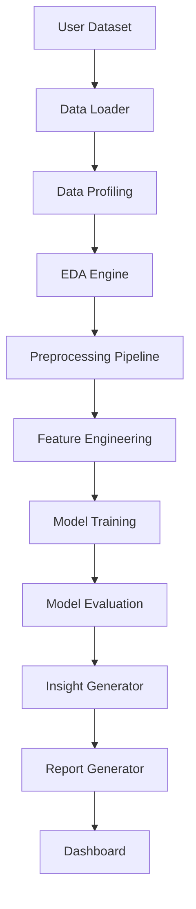

# AutoAnalyst AI

> Automated AI-Powered Data Analyst System


AutoAnalyst AI is a collaborative, beginner-friendly, professional data science project that automates the core workflow of a data analyst: loading raw data, understanding it, profiling it, exploring it, cleaning it, engineering features, training models, evaluating results, generating insights, and presenting reports through a dashboard.

## Problem Statement

Many students and junior data practitioners understand individual tools such as Pandas, Scikit-learn, and Streamlit, but struggle to connect them into a clean, reusable, team-built system. AutoAnalyst AI provides a structured project where a team can learn professional collaboration while building a useful automated analysis pipeline.

## Objectives

- Build a modular Python package for automated data analysis.
- Provide clear starter code for each pipeline stage.
- Train team members on GitHub branches, commits, pull requests, and reviews.
- Create reusable documentation for planning, workflow, roles, and architecture.
- Deliver a basic Streamlit dashboard for dataset upload and quick analysis.

## Key Features

| Area | Starter Capability |
|---|---|
| Data Loading | CSV and Excel loading helpers |
| Data Profiling | Shape, dtypes, missing values, duplicates |
| EDA | Numeric summaries and correlations |
| Cleaning | Duplicate removal and missing-value handling |
| Feature Engineering | Basic datetime feature creation |
| Modeling | Simple classification and regression wrappers |
| Evaluation | Classification and regression metrics |
| Insights | Rule-based insight generation |
| Reporting | Markdown report generation |
| Dashboard | Streamlit upload, preview, statistics |

## System Architecture



## Folder Structure

```text
AutoAnalyst-AI/
├── app/                    # Streamlit application
├── data/                   # Raw, processed, and sample datasets
├── docs/                   # Planning and collaboration documentation
├── notebooks/              # Exploration and experiment notebooks
├── reports/                # Figures and generated reports
├── src/autoanalyst/        # Main Python package
├── tests/                  # Automated tests
├── .github/                # GitHub templates and workflows
├── README.md
├── requirements.txt
├── pyproject.toml
└── LICENSE
```

## Tech Stack

- Python 3.10+
- Pandas, NumPy
- Scikit-learn
- Matplotlib, Seaborn, Plotly
- Streamlit
- Jupyter Notebook
- Pytest
- Markdown and Mermaid diagrams

## Installation

```bash
git clone https://github.com/<your-org-or-username>/AutoAnalyst-AI.git
cd AutoAnalyst-AI
python -m venv .venv
```

Windows PowerShell:

```powershell
.venv\Scripts\Activate.ps1
pip install -r requirements.txt
pip install -e .
```

Git Bash/macOS/Linux:

```bash
source .venv/bin/activate
pip install -r requirements.txt
pip install -e .
```

## Usage

Run the Streamlit dashboard:

```bash
streamlit run app/streamlit_app.py
```

Run tests:

```bash
pytest
```

Use the package in Python:

```python
from autoanalyst.data_loading.loader import load_csv
from autoanalyst.data_profiling.profiler import generate_basic_profile

df = load_csv("data/sample/example.csv")
profile = generate_basic_profile(df)
print(profile)
```

## Team Collaboration Workflow

AutoAnalyst AI uses a beginner-friendly professional GitHub workflow.

### Branch Policy

| Branch | Policy |
|---|---|
| `main` | Stable version only. No one should push directly to `main`. |
| `develop` | Integration branch for reviewed team work. Feature branches merge here first. |
| `feature/...` | Each member works on a separate branch created from `develop`. |

### Pull Request Policy

1. Start from the latest `develop` branch.
2. Create a feature branch such as `feature/data-profiling`.
3. Make focused changes with clear commits.
4. Push your branch to GitHub.
5. Open a Pull Request into `develop`.
6. Request at least one reviewer.
7. Resolve comments and conflicts before merge.
8. Only merge to `main` when the project lead decides `develop` is stable.

> Beginner note: Do **not** push directly to `main`. This protects the stable project version and helps the team review work safely.

See [`docs/workflow.md`](docs/workflow.md), [`CONTRIBUTING.md`](CONTRIBUTING.md), and [`docs/team_branch_assignments.md`](docs/team_branch_assignments.md) for the full collaboration process.

## Branch Strategy

| Branch Type | Example | Purpose |
|---|---|---|
| Stable | `main` | Production-ready project version |
| Integration | `develop` | Combines reviewed team work |
| Feature | `feature/eda-analysis` | New functionality |
| Fix | `fix/missing-values-bug` | Bug fixes |
| Docs | `docs/update-roadmap` | Documentation changes |
| Experiment | `experiment/model-comparison` | Temporary experiments |

## Team Roles

- Project Lead / GitHub Manager
- Data Understanding Member
- Data Profiling Member
- EDA Member
- Data Cleaning Member
- Feature Engineering Member
- Classification Modeling Member
- Regression Modeling Member
- Insight & Report Generation Member
- Dashboard Developer

See [`docs/team_roles.md`](docs/team_roles.md) for detailed responsibilities.

## Roadmap

- Week 1: Planning, GitHub setup, dataset selection
- Week 2: Data profiling and EDA
- Week 3: Preprocessing and feature engineering
- Week 4: Modeling and evaluation
- Week 5: Insights and report generation
- Week 6: Dashboard, documentation, and final presentation

See [`docs/roadmap.md`](docs/roadmap.md) and [`docs/project_plan.md`](docs/project_plan.md).

## Future Improvements

- More advanced automated profiling
- Model comparison and tuning
- Exportable HTML/PDF reports
- Better dashboard visualizations
- Optional LLM-powered insight summaries in later versions
- Docker and CI/CD enhancements in later phases

## Contributors

Add team members here:

| Name | Role | GitHub |
|---|---|---|
| Gharieb | Project Lead | `@username` |
| Member 2 | Data Understanding | `@username` |

## License

This project is licensed under the MIT License. See [`LICENSE`](LICENSE).
