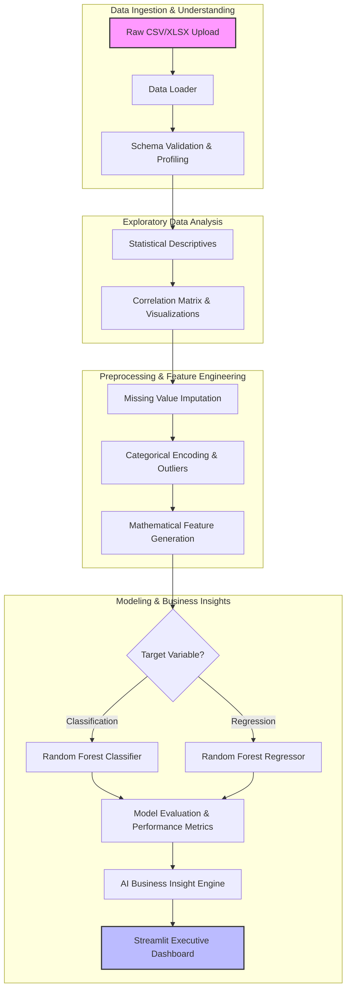

# 📊 AutoAnalyst AI
> **Enterprise-Grade Automated End-to-End Data Science & Machine Learning Pipeline**

[](https://www.python.org/)
[](https://streamlit.io/)
[](https://opensource.org/licenses/MIT)
[](https://github.com/GhariebML/AutoAnalyst-AI)

AutoAnalyst AI is a next-generation automated analytics engine designed to transform raw tabular datasets into professional analytical profiles, statistical visualizations, feature-engineered variables, predictive machine learning models, and actionable business insights. The entire workflow is presented through an interactive Streamlit executive dashboard.

---

## 🎯 Platform Core Architecture

Our architecture is strictly decoupled into modular package boundaries. The central execution lifecycle is orchestrated by a sequential pipeline, ensuring full reproducibility and auditability of data transformations.



---

## 📅 Project Release Timeline & Milestones

The project is structured around key delivery milestones for our enterprise release package:

| Milestone | Target Date | Status | Objectives |
| :--- | :--- | :--- | :--- |
| **🚀 Project Kickoff** | July 11, 2026 | **Completed** | Scope definition, repository structure lock, and initial codebase setup. |
| **❄️ Code Freeze** | July 23, 2026 | **In Progress** | Implementation freeze of all pipeline modules and unit test coverage checks. |
| **🔄 Integration Phase** | July 24, 2026 | **Planned** | Merging feature branches, resolve dependency conflicts, and run regression tests. |
| **📦 Final Release** | July 25, 2026 | **Planned** | Delivery of compiled PDF specifications, live presentation, and deployment. |

---

## 📂 Repository Structure

```text
AutoAnalyst-AI/
├── app/                        # Streamlit dashboard interface
│   └── streamlit_app.py        # Dashboard entry point
├── data/                       # Local dataset ingestion storage
│   ├── raw/                    # Raw credit risk & tabular uploads
│   ├── processed/              # Intermediary clean pipeline outputs
│   └── sample/                 # Verification files (example.csv)
├── docs/                       # Corporate handbooks and team specifications
│   ├── Teams/                  # Team specification folders
│   │   ├── 01-Team-Project-Management/
│   │   ├── 02-Team-Data-Profiling/
│   │   ├── 03-Team-EDA/
│   │   ├── 04-Team-Preprocessing/
│   │   ├── 05-Team-Modeling/
│   │   ├── 06-Team-Evaluation/
│   │   └── 07-Team-Dashboard/
│   └── PDF/                    # 13 Compiled enterprise PDFs
├── src/autoanalyst/            # Core Python package codebase
│   ├── data_loading/           # CSV/XLSX loaders and schema checks
│   ├── data_profiling/         # Missing pattern counters & types
│   ├── eda/                    # Correlation & descriptive statistics
│   ├── preprocessing/          # Null imputers & categorical encoders
│   ├── feature_engineering/    # Polynomial/ratio feature generator
│   ├── modeling/               # RF Classifier & Regressor training
│   ├── evaluation/             # Metrics calculator (F1, RMSE, R²)
│   ├── insights/               # Automated recommendation generator
│   ├── reporting/              # Markdown report compiler
│   ├── utils/                  # Shared helper scripts
│   └── pipeline.py             # Central orchestrator wrapper
├── tests/                      # Pytest automated test suites
├── pyproject.toml              # Build & dependency packaging
└── README.md                   # Platform documentation
```

---

## 📄 Compiled Enterprise Specifications (PDFs)

We have compiled exactly **13 enterprise-grade PDF handbooks** inside the [docs/PDF/](docs/PDF/) directory to guide developers and project leads:

### Team Guides & Responsibilities
1. 📂 **[01-Team-Project-Management.pdf](docs/PDF/01-Team-Project-Management.pdf)**: Project workflow coordination and release schedules.
2. 🔬 **[02-Team-Data-Profiling.pdf](docs/PDF/02-Team-Data-Profiling.pdf)**: Ingestion requirements, validation parameters, and type parsing.
3. 📈 **[03-Team-EDA.pdf](docs/PDF/03-Team-EDA.pdf)**: Data visualizations, distributions, and correlation maps.
4. ⚙️ **[04-Team-Preprocessing.pdf](docs/PDF/04-Team-Preprocessing.pdf)**: Imputation strategies, outlier rules, and categorical encoding.
5. 🤖 **[05-Team-Modeling.pdf](docs/PDF/05-Team-Modeling.pdf)**: Random Forest modeling architectures and hyperparameter specs.
6. 📊 **[06-Team-Evaluation.pdf](docs/PDF/06-Team-Evaluation.pdf)**: Core ML validation metrics and business recommendation engines.
7. 🖥️ **[07-Team-Dashboard.pdf](docs/PDF/07-Team-Dashboard.pdf)**: Streamlit UI components, session state, and export tools.

### Central Project Architecture & Onboarding Handbooks
* 📘 **[Project-Handbook.pdf](docs/PDF/Project-Handbook.pdf)**: Organizational team leads, roadmap, and contact lists.
* 💻 **[Developer-Handbook.pdf](docs/PDF/Developer-Handbook.pdf)**: Development environment instructions and code review policies.
* 🏗️ **[Architecture.pdf](docs/PDF/Architecture.pdf)**: In-depth package boundary maps and data payload flows.
* 🧩 **[Integration-Guide.pdf](docs/PDF/Integration-Guide.pdf)**: Module interfaces, regression safety, and PR integration protocols.
* 🚀 **[Deployment-Guide.pdf](docs/PDF/Deployment-Guide.pdf)**: Streamlit hosting guides, Docker configurations, and containerization.
* 🐙 **[Git-Workflow.pdf](docs/PDF/Git-Workflow.pdf)**: Branch naming rules, semantic commit standards, and PR template guidelines.

---

## 💻 Developer Setup & Running Guide

### 1. Prerequisites
Ensure you have **Python 3.10+** installed on your system.

### 2. Installation
Clone the repository and set up a clean Python virtual environment:
```bash
git clone https://github.com/GhariebML/AutoAnalyst-AI.git
cd AutoAnalyst-AI
python -m venv .venv
```

Activate the environment:
* **Windows (PowerShell)**:
  ```powershell
  .venv\Scripts\Activate.ps1
  ```
* **macOS / Linux (Git Bash)**:
  ```bash
  source .venv/bin/activate
  ```

Install requirements and configure the project in editable mode:
```bash
pip install -r requirements.txt
pip install -e .
```

### 3. Running the Streamlit Dashboard
Launch the dashboard interface locally:
```bash
streamlit run app/streamlit_app.py
```

### 4. Running the Test Suite
Ensure code stability by executing our automated regression tests:
```bash
pytest
```

---

## 🐙 Git Flow & Branch Policies

To maintain the stability of our core releases, the repository enforces a structured Git Flow:

* **Branch Rules**:
  * Pushing directly to `main` or `develop` branches is strictly blocked.
  * All active feature modifications must occur on dedicated sub-team branches (e.g., `feature/data-profiling`).
  * Pull requests must target the `develop` branch and require approval from the **Project Management (Team 1)** team.

* **Commit Message Format**:
  Commit messages must follow semantic conventions:
  * `feat: ...` for new functional pipeline blocks.
  * `fix: ...` for resolving pipeline bugs.
  * `docs: ...` for documentation updates.
  * `test: ...` for adding verification tests.

---

## 👥 Contributors & Core Organization

* **Team 1: PM & Systems Integration**  
  * Mohamed Gharieb (Lead)  
  * Mohamed Abd Elkhalek  

* **Team 2: Data Profiling Engine**  
  * Aya Emad (Lead)  
  * Aya Mostafa  

* **Team 3: EDA & Visualization**  
  * Mohamed Kamal (Lead)  
  * Yomna Ashraf  
  * Samar Mahmoud  

* **Team 4: Preprocessing & Feature Engineering**  
  * Basma Mansour (Lead)  
  * Bothaina Elqady  

* **Team 5: Machine Learning Engine**  
  * Mohamed Khaled El-Shayp (Lead)  
  * Ahmed Gamal  

* **Team 6: Evaluation & Insights**  
  * Youssef Al-komi (Lead)  
  * Sohad Abd El-Mohsen  

* **Team 7: Dashboard & Reporting**  
  * Hazem (Lead)  
  * Mahmoud Maher  
