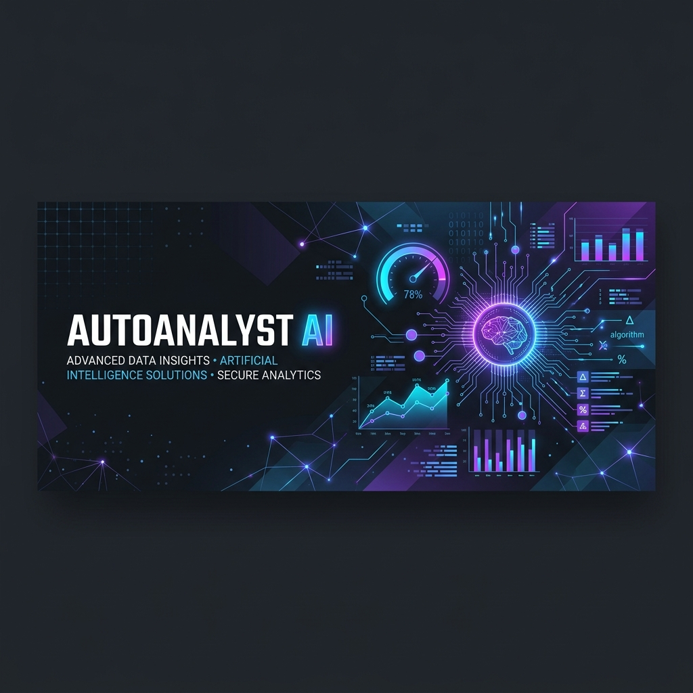

<div align="center">



# 📊 AutoAnalyst AI
### *Enterprise-Grade End-to-End Autonomous Data Analyst & ML Pipeline*

[](https://www.python.org/)
[](https://streamlit.io/)
[](https://opensource.org/licenses/MIT)
[](https://github.com/GhariebML/AutoAnalyst-AI)

<p align="center">
  <b>AutoAnalyst AI</b> is a production-ready automated analytics platform. It consumes raw tabular datasets and autonomously executes schema profiling, descriptive statistical analysis, exploratory visualizations, categorical encoding, polynomial feature engineering, machine learning modeling (classification/regression), metrics evaluation, and business insight writing—all delivered via an interactive Streamlit dashboard.
</p>

[✨ Core Workflow](#-core-workflow) • [📂 Project Structure](#-project-structure) • [📅 Release Timeline](#-release-timeline) • [📘 Handbooks](#-compiled-specifications) • [💻 Setup Guide](#-developer-onboarding)

</div>

---

## ⚙️ Core Workflow

The platform follows a decoupled, sequential pipeline structure where each step validates the output schema before handing it over to the next module.

```mermaid
flowchart LR
    %% Style definitions
    classDef ingest fill:#1e293b,stroke:#3b82f6,stroke-width:2px,color:#fff;
    classDef eda fill:#1e293b,stroke:#a855f7,stroke-width:2px,color:#fff;
    classDef preprocess fill:#1e293b,stroke:#eab308,stroke-width:2px,color:#fff;
    classDef model fill:#1e293b,stroke:#10b981,stroke-width:2px,color:#fff;
    classDef output fill:#1e293b,stroke:#ef4444,stroke-width:2px,color:#fff;

    %% Nodes
    subgraph Ingestion["📥 Data Ingestion"]
        A["Raw Data Ingest<br>(CSV / Excel)"]:::ingest
        B["Schema Validation<br>& Parsing"]:::ingest
        A --> B
    end

    subgraph Analysis["📊 Auto EDA"]
        C["Descriptive Statistics<br>(Mean, Median, Skew)"]:::eda
        D["Feature Correlations<br>& Pearson Matrix"]:::eda
        C --> D
    end

    subgraph Cleaning["⚙️ Preprocessing"]
        E["Missing Value<br>Imputers"]:::preprocess
        F["Categorical Encoders<br>(One-Hot / Target)"]:::preprocess
        E --> F
    end

    subgraph Modeling["🤖 ML Engine"]
        G{"Target Column<br>Configured?"}:::model
        H["RF Classifier<br>(Classification)"]:::model
        I["RF Regressor<br>(Regression)"]:::model
        G -- "Label" --> H
        G -- "Numeric" --> I
    end

    subgraph Insights["💡 Reporting & UI"]
        J["Auto-Evaluator<br>(F1, RMSE, R²)"]:::output
        K["Insight Generator<br>(Recommender)"]:::output
        L["Streamlit Dashboard<br>& Markdown Exporter"]:::output
        J --> K
        K --> L
    end

    %% Pipeline flow connections
    B --> C
    D --> E
    F --> G
    H & I --> J
```



---

## 📂 Project Structure

```text
AutoAnalyst-AI/
├── app/                        # Streamlit dashboard interface
│   └── streamlit_app.py        # Dashboard entry point
├── data/                       # Local dataset ingestion storage
│   ├── raw/                    # Raw credit risk & tabular uploads
│   ├── processed/              # Intermediary clean pipeline outputs
│   └── sample/                 # Verification files (example.csv)
├── docs/                       # Corporate handbooks and team specifications
│   ├── Teams/                  # Team specification folders
│   │   ├── 01-Team-Project-Management/
│   │   ├── 02-Team-Data-Profiling/
│   │   ├── 03-Team-EDA/
│   │   ├── 04-Team-Preprocessing/
│   │   ├── 05-Team-Modeling/
│   │   ├── 06-Team-Evaluation/
│   │   └── 07-Team-Dashboard/
│   └── PDF/                    # 13 Compiled enterprise PDFs
├── src/autoanalyst/            # Core Python package codebase
│   ├── data_loading/           # CSV/XLSX loaders and schema checks
│   ├── data_profiling/         # Missing pattern counters & types
│   ├── eda/                    # Correlation & descriptive statistics
│   ├── preprocessing/          # Null imputers & categorical encoders
│   ├── feature_engineering/    # Polynomial/ratio feature generator
│   ├── modeling/               # RF Classifier & Regressor training
│   ├── evaluation/             # Metrics calculator (F1, RMSE, R²)
│   ├── insights/               # Automated recommendation generator
│   ├── reporting/              # Markdown report compiler
│   ├── utils/                  # Shared helper scripts
│   └── pipeline.py             # Central orchestrator wrapper
├── tests/                      # Pytest automated test suites
├── pyproject.toml              # Build & dependency packaging
└── README.md                   # Platform documentation
```

---

## 📅 Release Timeline

| Milestone | Target Date | Status | Objectives |
| :--- | :--- | :--- | :--- |
| **🚀 Project Kickoff** | July 11, 2026 | **Completed** | Scope definition, repository structure lock, and initial codebase setup. |
| **❄️ Code Freeze** | July 23, 2026 | **In Progress** | Implementation freeze of all pipeline modules and unit test coverage checks. |
| **🔄 Integration Phase** | July 24, 2026 | **Planned** | Merging feature branches, resolve dependency conflicts, and run regression tests. |
| **📦 Final Release** | July 25, 2026 | **Planned** | Delivery of compiled PDF specifications, live presentation, and deployment. |

---

## 📘 Compiled Specifications (PDFs)

Exactly **13 enterprise-grade PDF handbooks** are available inside the [docs/PDF/](docs/PDF/) directory to guide developers and project leads:

<details>
<summary><b>🔍 Expand Team-Specific Packages</b></summary>

1. 📂 **[01-Team-Project-Management.pdf](docs/PDF/01-Team-Project-Management.pdf)**: Project workflow coordination, timelines, and release schedules.
2. 🔬 **[02-Team-Data-Profiling.pdf](docs/PDF/02-Team-Data-Profiling.pdf)**: Ingestion requirements, validation parameters, and type parsing.
3. 📈 **[03-Team-EDA.pdf](docs/PDF/03-Team-EDA.pdf)**: Data visualizations, distributions, and correlation maps.
4. ⚙️ **[04-Team-Preprocessing.pdf](docs/PDF/04-Team-Preprocessing.pdf)**: Imputation strategies, outlier rules, and categorical encoding.
5. 🤖 **[05-Team-Modeling.pdf](docs/PDF/05-Team-Modeling.pdf)**: Random Forest modeling architectures and hyperparameter specs.
6. 📊 **[06-Team-Evaluation.pdf](docs/PDF/06-Team-Evaluation.pdf)**: Core ML validation metrics and business recommendation engines.
7. 🖥️ **[07-Team-Dashboard.pdf](docs/PDF/07-Team-Dashboard.pdf)**: Streamlit UI components, session state, and export tools.

</details>

<details>
<summary><b>🏗️ Expand Project Architecture & Handbooks</b></summary>

* 📘 **[Project-Handbook.pdf](docs/PDF/Project-Handbook.pdf)**: Organizational team leads, roadmap, and contact lists.
* 💻 **[Developer-Handbook.pdf](docs/PDF/Developer-Handbook.pdf)**: Development environment instructions and code review policies.
* 🏗️ **[Architecture.pdf](docs/PDF/Architecture.pdf)**: In-depth package boundary maps and data payload flows.
* 🧩 **[Integration-Guide.pdf](docs/PDF/Integration-Guide.pdf)**: Module interfaces, regression safety, and PR integration protocols.
* 🚀 **[Deployment-Guide.pdf](docs/PDF/Deployment-Guide.pdf)**: Streamlit hosting guides, Docker configurations, and containerization.
* 🐙 **[Git-Workflow.pdf](docs/PDF/Git-Workflow.pdf)**: Branch naming rules, semantic commit standards, and PR template guidelines.

</details>

---

## 💻 Developer Onboarding

### 1. Prerequisites
Ensure you have **Python 3.10+** installed on your system.

### 2. Installation & Virtual Environment Setup
Clone the repository and set up a clean Python virtual environment:
```bash
git clone https://github.com/GhariebML/AutoAnalyst-AI.git
cd AutoAnalyst-AI
python -m venv .venv
```

Activate the environment:
* **Windows (PowerShell)**:
  ```powershell
  .venv\Scripts\Activate.ps1
  ```
* **macOS / Linux**:
  ```bash
  source .venv/bin/activate
  ```

Install requirements and configure the project in editable mode:
```bash
pip install -r requirements.txt
pip install -e .
```

### 3. Launching the Streamlit Interface
Start the interactive dashboard locally:
```bash
streamlit run app/streamlit_app.py
```

### 4. Running Regression Tests
Validate changes using the automated pytest suite:
```bash
pytest
```

---

## 🐙 Git Flow & Code Review Policies

To guarantee branch isolation and system stability, the repository enforces a strict merge protocol:

- **Branch Separation**: All active code development must take place on dedicated feature branches (e.g., `feature/data-profiling`).
- **PR Approval**: Pull requests must target the `develop` branch and require review and approval from **Team 1 (Project Management)** before integration.
- **Commit Messages**: Commits must start with semantic tags (`feat:`, `fix:`, `docs:`, `test:`, or `refactor:`).

---

## 👥 Contributors & Core Organization

```text
PM & Integration (Team 1)    ───► Mohamed Gharieb (Lead), Mohamed Abd Elkhalek
Data Profiling (Team 2)       ───► Aya Emad (Lead), Aya Mostafa
EDA & Visuals (Team 3)        ───► Mohamed Kamal (Lead), Yomna Ashraf, Samar Mahmoud
Preprocessing (Team 4)        ───► Basma Mansour (Lead), Bothaina Elqady
Machine Learning (Team 5)     ───► Mohamed Khaled El-Shayp (Lead), Ahmed Gamal
Evaluation & Insights (Team 6)───► Youssef Al-komi (Lead), Sohad Abd El-Mohsen
Dashboard & Reporting (Team 7) ───► Hazem (Lead), Mahmoud Maher
```
