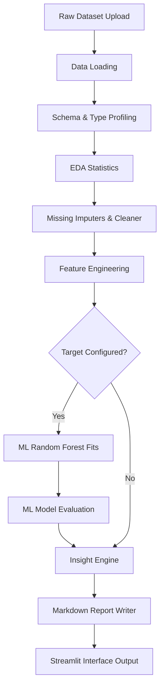

# AutoAnalyst AI
> Automated AI-Powered Data Analyst Platform


AutoAnalyst AI is an enterprise-grade automated data analyst platform designed to transform raw datasets into clean analytical structures, predictive machine learning models, statistical visualizations, and interactive business insights presented via a Streamlit dashboard.

---

## 1. Core Vision & Ingestion Workflow

Our platform automates the end-to-end analytical lifecycle in a decoupled, sequential pipeline, ensuring predictable, testable, and reproducible data operations.



---

## 2. Release & Delivery Timeline

The project follows a milestone-based delivery structure. The milestones for the final package release are as follows:

| Milestone | Target Date | Status | Description |
| :--- | :--- | :--- | :--- |
| **Project Kickoff** | 11 July 2026 | COMPLETED | System scope locked & codebase base package release. |
| **Code Freeze** | 23 July 2026 | IN PROGRESS | Package implementation finalized; unit test freezes. |
| **Integration Phase** | 24 July 2026 | PLANNED | Multi-team branch joins and orchestrator regressions. |
| **Final Presentation** | 25 July 2026 | PLANNED | Production delivery release and live dashboard demo. |

---

## 3. Directory Layout

The codebase has been restructured into clean package boundaries and enterprise documentation paths:

```text
AutoAnalyst-AI/
├── app/                        # Streamlit dashboard application
│   └── streamlit_app.py        # Dashboard entry point
├── data/                       # Ingestion datasets storage
│   ├── raw/
│   ├── processed/
│   └── sample/                 # Test files (e.g. example.csv)
├── docs/                       # Technical specs and handbooks
│   ├── Teams/                  # Team-specific spec folders
│   │   ├── 01-Team-Project-Management/
│   │   ├── 02-Team-Data-Profiling/
│   │   ├── ...
│   │   └── 07-Team-Dashboard/
│   └── PDF/                    # 13 Compiled enterprise PDFs
├── src/autoanalyst/            # Core Python package modules
│   ├── data_loading/
│   ├── data_profiling/
│   ├── eda/
│   ├── preprocessing/
│   ├── feature_engineering/
│   ├── modeling/
│   ├── evaluation/
│   ├── insights/
│   ├── reporting/
│   ├── utils/
│   └── pipeline.py             # Orchestrator core
├── tests/                      # Automated test code suites
├── pyproject.toml              # Build & packaging parameters
└── README.md                   # Platform overview
```

---

## 4. Technical Delivery Packages & Documentation

All technical specifications, workflows, and handbooks are fully documented. The compiled PDF versions are available under [docs/PDF/](docs/PDF/):

### Team-Specific Packages
1. **[01-Team-Project-Management.pdf](docs/PDF/01-Team-Project-Management.pdf)**: Project managers & integration guidelines.
2. **[02-Team-Data-Profiling.pdf](docs/PDF/02-Team-Data-Profiling.pdf)**: CSV/Excel readers, schema validators.
3. **[03-Team-EDA.pdf](docs/PDF/03-Team-EDA.pdf)**: Numeric descriptive summaries & correlations.
4. **[04-Team-Preprocessing.pdf](docs/PDF/04-Team-Preprocessing.pdf)**: Missing value imputations & categorical encoders.
5. **[05-Team-Modeling.pdf](docs/PDF/05-Team-Modeling.pdf)**: RandomForest classifier and regressor wrappers.
6. **[06-Team-Evaluation.pdf](docs/PDF/06-Team-Evaluation.pdf)**: ML evaluation and business insights engines.
7. **[07-Team-Dashboard.pdf](docs/PDF/07-Team-Dashboard.pdf)**: Streamlit UI and markdown exporter.

### Core Handbooks & System Guides
- **[Project-Handbook.pdf](docs/PDF/Project-Handbook.pdf)**: Team structure, kickoff parameters, and roles.
- **[Developer-Handbook.pdf](docs/PDF/Developer-Handbook.pdf)**: Local environment activation & quality standards.
- **[Architecture.pdf](docs/PDF/Architecture.pdf)**: Decoupled package boundaries and sequential pipeline design.
- **[Integration-Guide.pdf](docs/PDF/Integration-Guide.pdf)**: Merge guidelines, verification rules, and branch reviews.
- **[Deployment-Guide.pdf](docs/PDF/Deployment-Guide.pdf)**: Streamlit dashboard activation, local running, and Docker builds.
- **[Git-Workflow.pdf](docs/PDF/Git-Workflow.pdf)**: Git commit prefixes and pull request requirements.

---

## 5. Developer Guide & Setup

### Installation
Clone the repository and set up a virtual environment:

```bash
git clone https://github.com/GhariebML/AutoAnalyst-AI.git
cd AutoAnalyst-AI
python -m venv .venv
```

Activate the environment (Windows PowerShell):
```powershell
.venv\Scripts\Activate.ps1
```

Activate the environment (Git Bash / Linux / macOS):
```bash
source .venv/bin/activate
```

Install requirements and the editable package:
```bash
pip install -r requirements.txt
pip install -e .
```

### Run the Dashboard
Run the Streamlit interactive dashboard:
```bash
streamlit run app/streamlit_app.py
```

### Running Test Suites
Validate the codebase using `pytest`:
```bash
pytest
```

---

## 6. Contributing & Branch Policies

To ensure stability, developers must check code freeze dates and use the proper git flow:
- All developers work on their designated `feature/` branch (e.g. `feature/data-profiling`).
- Pushing code directly to the `develop` or `main` branches is blocked.
- Commit logs must follow semantic prefixes: `feat:`, `fix:`, `docs:`, `test:`, or `refactor:`.
- Create Pull Requests targeting `develop`. The PR must be reviewed and approved by Team 1.

---

## 7. Contributors & Team Leads

- **PM & Systems Integration**: Mohamed Gharieb, Mohamed Abd Elkhalek
- **Data Profiling Engine**: Aya Emad, Aya Mostafa
- **EDA Engine**: Mohamed Kamal, Yomna Ashraf, Samar Mahmoud
- **Preprocessing Engine**: Basma Mansour, Bothaina Elqady
- **Machine Learning Engine**: Mohamed Khaled El-Shayp, Ahmed Gamal
- **Evaluation & Insights Engine**: Youssef Al-komi, Sohad Abd El-Mohsen
- **Dashboard & Reporting**: Hazem, Mahmoud Maher
