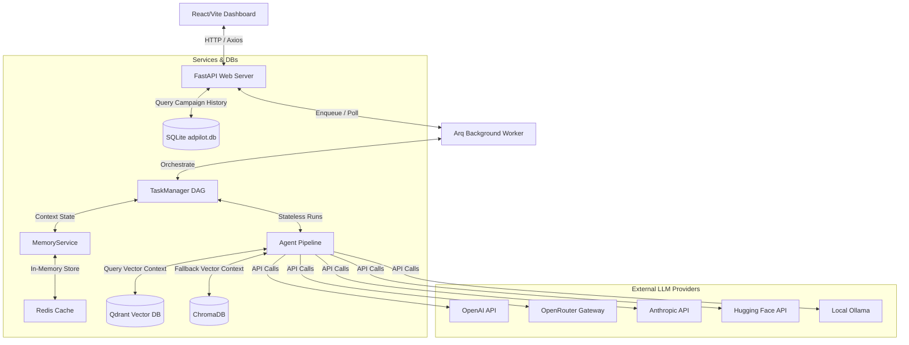
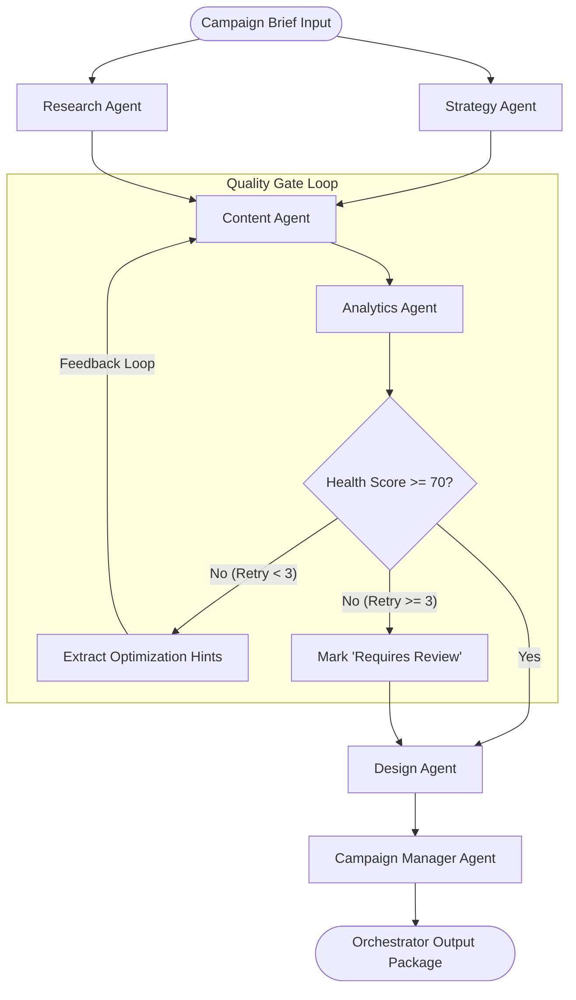

# ADPilot Pro

**Enterprise-Grade Autonomous Marketing Agency Powered by Multi-Agent AI Systems.**

ADPilot Pro turns structured marketing campaign briefs into complete, launch-ready packages. By coordinating **11 specialized AI agents** (covering strategy, market research, competitor analysis, copywriting, analytics feedback, design concepting, and budget scheduling), it delivers comprehensive, consistent, and validated campaigns in seconds.

The system utilizes Pydantic schemas as a single source of truth for contracts, and is built on FastAPI and React. It features a self-correcting multi-agent execution cycle where an evaluation agent scores content quality and feeds back recommendations to optimize the copy autonomously.

---

## Technical Badges & Ecosystem


---

## 🏗️ System Architecture

ADPilot Pro is divided into a fast FastAPI backend, a background worker runner powered by Redis, and a modern React client. The agents use a shared memory context to load and save execution states seamlessly.



---

## 🔄 Self-Correcting Quality Gate Loop

The core innovation of ADPilot Pro is the integration of a **Quality Gate** evaluation stage. Rather than executing a simple linear sequence, the system runs a cyclic optimization loop to guarantee that marketing copy meets quality and policy requirements before design and budget allocation are initiated:



1. **Content & Analytics Loop**: The `ContentAgent` generates copy, which is immediately scored by `AnalyticsAgent` against alignment, tone of voice, formatting limits, and brand guidelines.
2. **Feedback Routing**: If the score is below 70, the orchestrator extracts concrete recommendations (e.g. "Headline is too long", "Tone is too salesy") and sends them back to `ContentAgent` for a retry.
3. **Execution Cap**: The loop runs up to 3 times. If it fails to reach the quality threshold, it bypasses final design generation and reports `REQUIRES REVIEW` to protect API costs and avoid bad output.

---

## 🤖 Specialized Agent Registry

ADPilot Pro coordinates **11 autonomous agents**, each assigned to a single domain of campaign creation:

| Agent Name | Description | Key Inputs | Key Outputs / Deliverables |
| :--- | :--- | :--- | :--- |
| **StrategyAgent** | Creates positioning statements, chooses core channels, and sets marketing themes. | `CampaignInput` | `StrategyAgentOutput` (Funnel stages, positioning) |
| **ResearchAgent** | Conducts synthetic target audience profiling and market trend analyses. | `CampaignInput` | `ResearchAgentOutput` (Persona profiles, industry insights) |
| **CompetitorAgent** | Inspects market competitors and suggests points of differentiation. | `CampaignInput` | Competitor analysis matrix and gaps |
| **AudienceAgent** | Segment audiences and maps key pain points to product benefits. | `CampaignInput` | Demographic & psychographic target profiles |
| **ContentAgent** | Drafts text assets, including ads, social posts, and email sequences. | `Strategy`, `Research`, Hints | `ContentAgentOutput` (Ads, email sequences, posts) |
| **AnalyticsAgent** | Scores content quality and verifies compliance with safety policies. | Generated Content | `AnalyticsAgentOutput` (Health score, retry hints) |
| **CreativeAgent** | Outlines design direction, color guides, and asset visual concepts. | `Strategy`, `Content` | Visual moodboards, styling directions |
| **DesignAgent** | Formulates precise text-to-image prompts (e.g., DALL-E) for ad graphics. | `Strategy`, `Content` | `DesignAgentOutput` (Image prompts, brand rules) |
| **OptimizationAgent** | Adapts copy and target parameters dynamically based on incoming feedback. | Campaign results | Copy adjustments and targeting fine-tunes |
| **PublishingAgent** | Sets distribution channels and content publication schedules. | Content package | Ad placement schedules |
| **CampaignManagerAgent**| Computes budget allocations, drafts A/B test plans, and sets targets. | Complete Context | `CampaignManagerOutput` (Budget split, A/B test outline) |

---

## 📂 Project Structure

```text
ADPilot-Pro/
├── .github/                 # CI/CD Workflows, pull request and issue templates
├── src/adpilot/             # Core Python package
│   ├── agents/              # Specialized AI Agent modules
│   ├── api/                 # FastAPI router layer and endpoint handlers
│   ├── core/                # Config files, BaseAgent class, custom exceptions
│   ├── memory/              # Memory storage classes for agents
│   ├── models/              # Internal database/ORM models
│   ├── orchestration/       # TaskManager DAG and orchestrator runner
│   ├── prompts/             # System templates and instruction sets
│   ├── providers/           # Provider-specific adapter models
│   ├── schemas/             # Pydantic v2 schemas (Source of Truth)
│   ├── services/            # Database operations, client calls, memory management
│   └── utils/               # Logs configuration and helper utilities
├── frontend/                # React / TypeScript / Vite Dashboard
│   ├── public/              # Static assets
│   ├── src/                 # Client UI source code (components, hooks, state)
│   └── package.json         # Frontend dependencies and configuration
├── data/                    # Local storage structures
│   ├── samples/             # Raw JSON payloads for schema testing
│   └── outputs/             # Campaign run output folder
├── docs/                    # Architectural documents and setups
├── scripts/                 # CLI runner utilities for local testing
├── tests/                   # Pytest test suites (backend & integration)
├── Dockerfile               # Backend container configuration
├── docker-compose.yml       # Multi-container orchestration (FastAPI + Redis)
├── pyproject.toml           # Python configuration (ruff, pytest)
├── uv.lock                  # Python package locking (uv manager)
└── requirements.txt         # Production runtime dependencies
```

---

## ⚡ Quick Start

### Prerequisites

- **Python:** Version 3.12 or higher.
- **NodeJS:** Version 20 or higher (for the frontend).
- **Redis:** Running locally or accessible via URL (for the worker queue).

---

### Backend Setup

1. **Clone and enter the repository:**
   ```powershell
   git clone https://github.com/GhariebML/ADPilot-Pro.git
   cd ADPilot-Pro
   ```

2. **Create and activate a virtual environment:**
   *Using standard venv:*
   ```powershell
   python -m venv .venv
   .\.venv\Scripts\Activate.ps1
   ```
   *Or using `uv` (recommended for faster package resolutions):*
   ```powershell
   uv venv
   .\.venv\Scripts\Activate.ps1
   ```

3. **Install dependencies:**
   ```powershell
   pip install -r requirements.txt
   pip install -r requirements-dev.txt
   ```

4. **Set up environment variables:**
   Copy the example environment template:
   ```powershell
   Copy-Item .env.example .env
   ```
   Fill in your configuration settings (see [Environment Variables](#-environment-variables)).

5. **Start the FastAPI application server:**
   ```powershell
   $env:PYTHONPATH="src"
   python -m uvicorn adpilot.api.main:app --host 127.0.0.1 --port 8000 --reload
   ```
   - Swagger Documentation: `http://127.0.0.1:8000/docs`
   - Health endpoint: `http://127.0.0.1:8000/healthz`

6. **Start the background task worker (arq):**
   ```powershell
   $env:PYTHONPATH="src"
   arq adpilot.worker.WorkerSettings
   ```

---

### Frontend Setup

1. **Navigate to the frontend folder:**
   ```powershell
   cd frontend
   ```

2. **Install Node packages:**
   ```powershell
   npm install
   ```

3. **Run the Vite development server:**
   ```powershell
   npm run dev -- --host 127.0.0.1
   ```
   Open `http://127.0.0.1:5173` in your browser.

---

## ⚙️ Environment Variables

The application reads configurations from the local `.env` file. A comprehensive preview of supported parameters:

| Variable | Description | Example / Default |
| :--- | :--- | :--- |
| `LLM_PROVIDER` | Selection of active LLM backend | `openai`, `openrouter`, `huggingface`, `ollama` |
| `OPENAI_API_KEY` | Secret token for OpenAI | `sk-...` |
| `OPENAI_MODEL` | Target OpenAI model | `gpt-4o` |
| `OPENROUTER_API_KEY`| Token for OpenRouter API | `sk-or-...` |
| `OPENROUTER_MODEL` | Model routing template on OpenRouter | `google/gemini-2.5-pro` or `openrouter/free` |
| `HF_TOKEN` | Token for Hugging Face server access | `hf_...` |
| `HF_MODEL` | Target Hugging Face inference endpoint | `deepseek-ai/DeepSeek-R1` |
| `REDIS_URL` | Redis endpoint path (worker queue) | `redis://localhost:6379/0` |
| `ADPILOT_DASHBOARD_USE_REAL_LLM` | Force client to request actual LLM runs | `true` (default: `false`, fallback to demo) |
| `TEMPERATURE` | LLM creativity ceiling | `0.2` (low temperature preserves structured Pydantic schemas) |
| `ENVIRONMENT` | Running context environment | `development` / `production` |

---

## 🧪 Testing & Code Quality

Validate correctness and formatting before committing:

### Python Backend Testing

```powershell
# Format check and import sorting via Ruff
ruff check .

# Execute backend unit and integration test suites
pytest -v
```

### Frontend Build Verification

```powershell
cd frontend
# Run TypeScript compilation and bundle build
npm run build
```

---

## 🔒 Security Policy

- **Credential Hygiene:** Never commit `.env` or credentials. The project contains custom exclusions in `.gitignore` to protect against accidental credential leaks.
- **Exposure Response:** If a key is committed, rotate it immediately in the provider dashboard.
- **Reporting Vulnerabilities:** Please see the [Security Guidelines](SECURITY.md) to report issues safely.

---

## 📄 License

This project is licensed under the MIT License - see the [LICENSE](LICENSE) file for details.
