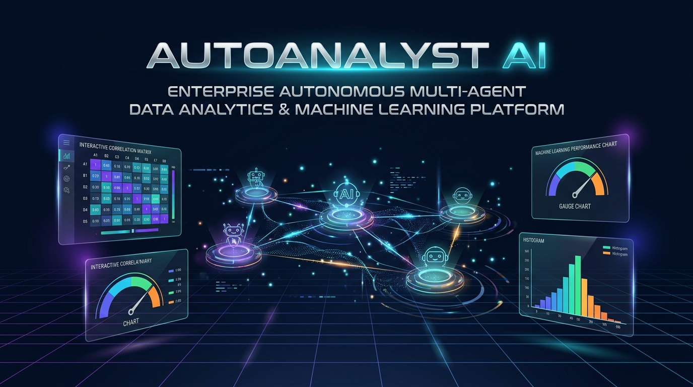
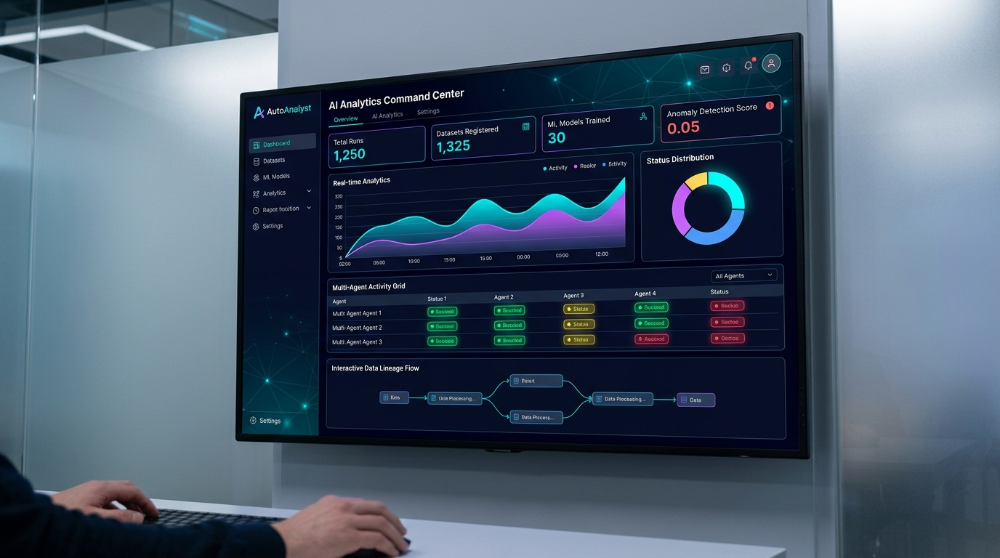
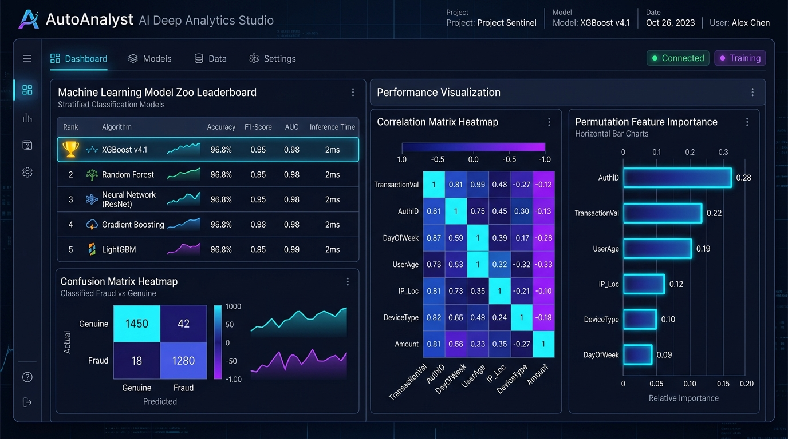
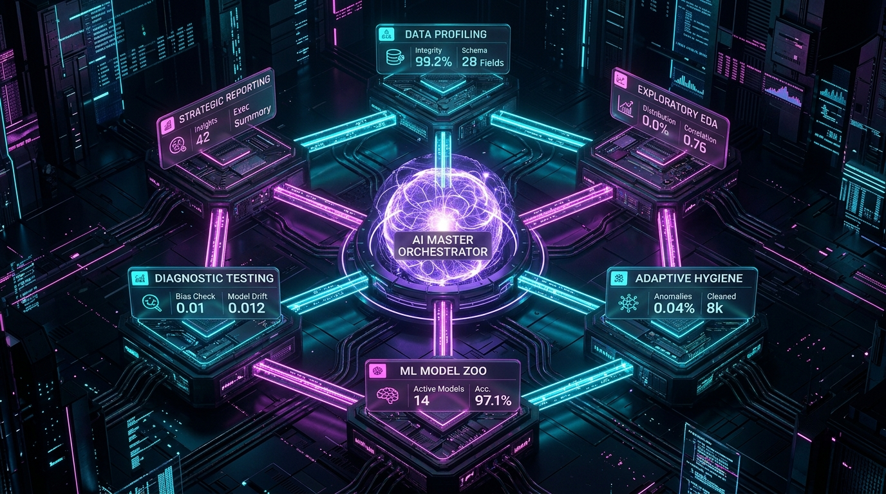
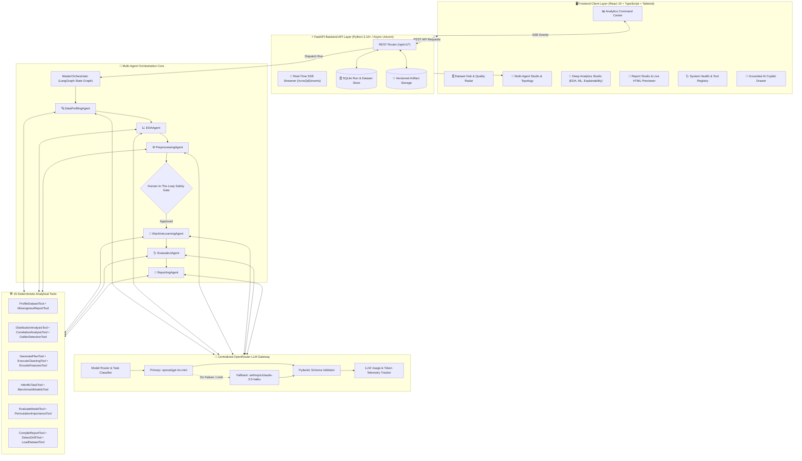
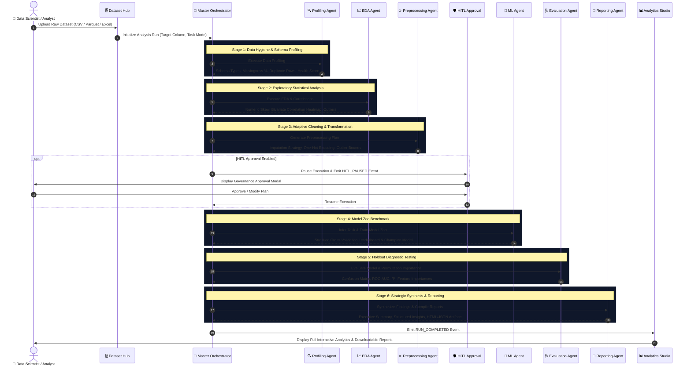

<div align="center">



# 📊 AutoAnalyst AI
### *Enterprise Full-Stack Autonomous Multi-Agent Data Analytics & Machine Learning Platform*

[](https://www.python.org/)
[](https://fastapi.tiangolo.com/)
[](https://react.dev/)
[](https://openrouter.ai/)
[](https://pytest.org/)
[](https://github.com/GhariebML/AutoAnalyst-AI)
[](LICENSE)

<p align="center">
  <b>AutoAnalyst AI</b> is a state-of-the-art, AI-native autonomous data analytics platform. It orchestrates a coordinated team of <b>specialized autonomous agents</b> to ingest raw tabular datasets, audit schema hygiene, compute bivariate correlation topologies, execute adaptive cleaning, benchmark predictive machine learning zoos, evaluate diagnostic holdout metrics, and compile interactive C-suite strategy reports—delivered via a high-density <b>Cyber Dark Command Center</b>.
</p>

[✨ System Highlights](#-system-highlights) • [🖼️ Platform UI Showcase](#-platform-ui-showcase) • [🏛️ Architecture & Diagrams](#-architecture--diagrams) • [🤖 Multi-Agent Mesh](#-multi-agent-autonomous-mesh) • [🛠️ Analytical Tools](#-analytical-tools-catalog) • [💻 Setup & Quickstart](#-setup--quickstart) • [📡 API & Telemetry](#-api-endpoints--telemetry) • [🧪 Testing & Benchmarks](#-testing--quality-assurance)

</div>

---

## ✨ System Highlights

- 🤖 **Autonomous Multi-Agent Topology**: Coordinated by `MasterOrchestrator` across 6 specialized agents (`DataProfiling`, `EDA`, `Preprocessing`, `MachineLearning`, `Evaluation`, `Reporting`) with Human-In-The-Loop (HITL) safety governance.
- 🧠 **Centralized OpenRouter LLM Gateway**: Dynamic model routing, automated fallback cascading (`openai/gpt-4o-mini` $\to$ `anthropic/claude-3.5-haiku`), exponential backoff on rate limits, Pydantic structured output validation, and live token telemetry tracking.
- 🛠️ **15 Deterministic Analytical Tools**: Production-grade tools for statistical distribution, missingness diagnosis, correlation topology, adaptive cleaning, model zoo benchmarking, and permutation feature importance.
- 📊 **Analytics Command Center UI**: Real-time KPI row, time-series runs trends (7D/30D/90D), run status distribution donuts, and multi-agent activity monitoring.
- 🔬 **Deep Analytics Studio**: Interactive 5-tab workspace covering *Executive Strategy*, *Model Zoo Benchmarks & Confusion Matrix*, *Correlation Heatmaps*, *Permutation Feature Drivers*, and *Preprocessing Transformations*.
- 📑 **Interactive Report Studio**: Real-time embedded HTML report previewer with responsive Chart.js visual charts and one-click multi-format downloads (`.HTML`, `.JSON`, `.CSV`).
- 🩺 **System Health & Tool Registry**: Live latency diagnostics for SQLite, Storage, Orchestrator, and OpenRouter LLM, paired with a searchable 15-tool catalog.
- 💬 **Context-Aware AI Analyst Copilot**: Grounded conversational assistant answering dataset questions directly against run state and tool outputs.

---

## 🖼️ Platform UI Showcase

<div align="center">

### 📊 Analytics Command Center Dashboard
*Real-time KPI telemetry, time-series analysis trends, run status distributions, and multi-agent execution monitors.*



<br/>

### 🔬 Deep Analytics & Machine Learning Studio
*Stratified cross-validation model zoo leaderboards, correlation topology heatmaps, permutation feature rankings, and confusion matrices.*



</div>

---

## 🏛️ Architecture & Diagrams

<div align="center">

### 🤖 3D Multi-Agent Orchestration Mesh
*Specialized autonomous agents collaborating over deterministic tool pipelines and central LLM reasoning.*



</div>

### 1. Full-Stack System Architecture


```mermaid
flowchart TD
    subgraph Client["🖥️ Frontend Client Layer (React 19 + TypeScript + Tailwind)"]
        UI_Dash["📊 Analytics Command Center"]
        UI_Hub["🗄️ Dataset Hub & Quality Radar"]
        UI_Studio["🤖 Multi-Agent Studio & Topology"]
        UI_Deep["🔬 Deep Analytics Studio (EDA, ML, Explainability)"]
        UI_Reports["📑 Report Studio & Live HTML Previewer"]
        UI_Health["🩺 System Health & Tool Registry"]
        UI_Chat["💬 Grounded AI Copilot Drawer"]
    end

    subgraph Gateway["⚡ FastAPI Backend API Layer (Python 3.10+ / Async Uvicorn)"]
        API_Routes["REST Router (/api/v1/*)"]
        SSE_Stream["📡 Real-Time SSE Streamer (/runs/{id}/events)"]
        DB_Store[("🗄️ SQLite Run & Dataset Store")]
        File_Store[("📁 Versioned Artifact Storage")]
    end

    subgraph LLMGateway["🧠 Centralized OpenRouter LLM Gateway"]
        Router["Model Router & Task Classifier"]
        PrimaryLLM["Primary: openai/gpt-4o-mini"]
        FallbackLLM["Fallback: anthropic/claude-3.5-haiku"]
        Validator["Pydantic Schema Validator"]
        Tracker["LLM Usage & Token Telemetry Tracker"]
    end

    subgraph AgentCore["🤖 Multi-Agent Orchestration Core"]
        Orchestrator["MasterOrchestrator (LangGraph State Graph)"]
        HITL_Gate{"Human-In-The-Loop Safety Gate"}
        
        Agent_Profile["🔍 DataProfilingAgent"]
        Agent_EDA["📈 EDAAgent"]
        Agent_Prep["⚙️ PreprocessingAgent"]
        Agent_ML["🤖 MachineLearningAgent"]
        Agent_Eval["🩺 EvaluationAgent"]
        Agent_Report["📑 ReportingAgent"]
    end

    subgraph Tools["🛠️ 15 Deterministic Analytical Tools"]
        T_Profile["ProfileDatasetTool • MissingnessReportTool"]
        T_EDA["DistributionAnalysisTool • CorrelationAnalysisTool • OutlierDetectionTool"]
        T_Prep["GeneratePlanTool • ExecuteCleaningTool • EncodeFeaturesTool"]
        T_ML["InferMLTaskTool • BenchmarkModelsTool"]
        T_Eval["EvaluateModelTool • PermutationImportanceTool"]
        T_Report["CompileReportTool • DetectDriftTool • LoadDatasetTool"]
    end

    %% Connections
    Client <-->|"REST API Requests"| API_Routes
    Gateway -->|"SSE Events"| UI_Studio
    Gateway -->|"SSE Events"| UI_Dash
    API_Routes <--> DB_Store
    API_Routes <--> File_Store
    API_Routes -->|"Dispatch Run"| Orchestrator

    Orchestrator --> Agent_Profile --> Agent_EDA --> Agent_Prep
    Agent_Prep --> HITL_Gate
    HITL_Gate -->|"Approved"| Agent_ML
    Agent_ML --> Agent_Eval --> Agent_Report

    Agent_Profile & Agent_EDA & Agent_Prep & Agent_ML & Agent_Eval & Agent_Report <--> Tools
    Agent_Profile & Agent_EDA & Agent_Prep & Agent_ML & Agent_Eval & Agent_Report <--> LLMGateway
    Router --> PrimaryLLM
    PrimaryLLM -.->|"On Failure / Limit"| FallbackLLM
    PrimaryLLM & FallbackLLM --> Validator --> Tracker
```

---

### 2. End-to-End Analytical Data Lineage


```mermaid
sequenceDiagram
    autonumber
    actor User as 👤 Data Scientist / Analyst
    participant Hub as 🗄️ Dataset Hub
    participant Orch as 🤖 Master Orchestrator
    participant Profile as 🔍 Profiling Agent
    participant EDA as 📈 EDA Agent
    participant Prep as ⚙️ Preprocessing Agent
    participant HITL as 🛡️ HITL Approval
    participant ML as 🤖 ML Agent
    participant Eval as 🩺 Evaluation Agent
    participant Rep as 📑 Reporting Agent
    participant UI as 📊 Analytics Studio

    User->>Hub: Upload Raw Dataset (CSV / Parquet / Excel)
    Hub->>Orch: Initialize Analysis Run (Target Column, Task Mode)
    
    rect rgb(15, 23, 42)
        Note over Orch, Profile: Stage 1: Data Hygiene & Schema Profiling
        Orch->>Profile: Execute Data Profiling
        Profile-->>Orch: Schema Types, Missingness %, Duplicate Rows, Health Score
    end

    rect rgb(15, 23, 42)
        Note over Orch, EDA: Stage 2: Exploratory Statistical Analysis
        Orch->>EDA: Execute EDA & Correlations
        EDA-->>Orch: Numeric Skew, Bivariate Correlation Heatmap, Outliers
    end

    rect rgb(15, 23, 42)
        Note over Orch, Prep: Stage 3: Adaptive Cleaning & Transformation
        Orch->>Prep: Generate Preprocessing Plan
        Prep-->>Orch: Imputation Strategy, One-Hot Encoding, Outlier Bounds
    end

    opt HITL Approval Enabled
        Orch->>HITL: Pause Execution & Emit HITL_PAUSED Event
        HITL->>User: Display Governance Approval Modal
        User->>HITL: Approve / Modify Plan
        HITL->>Orch: Resume Execution
    end

    rect rgb(15, 23, 42)
        Note over Orch, ML: Stage 4: Model Zoo Benchmark
        Orch->>ML: Infer Task & Train Model Zoo
        ML-->>Orch: Stratified Cross-Validation Leaderboard & Champion Model
    end

    rect rgb(15, 23, 42)
        Note over Orch, Eval: Stage 5: Holdout Diagnostic Testing
        Orch->>Eval: Evaluate Model & Permutation Importance
        Eval-->>Orch: Confusion Matrix, ROC-AUC, R², Feature Importances
    end

    rect rgb(15, 23, 42)
        Note over Orch, Rep: Stage 6: Strategic Synthesis & Reporting
        Orch->>Rep: Synthesize Findings & Compile Reports
        Rep-->>Orch: Executive Summary, Structured Insights, HTML/JSON Artifacts
    end

    Orch->>UI: Emit RUN_COMPLETED Event
    UI->>User: Display Full Interactive Analytics & Downloadable Reports
```

---

## 🤖 Multi-Agent Autonomous Mesh

AutoAnalyst AI deploys 6 specialized, deterministic agents that communicate through structured state transitions:

| Agent | Responsibility | Analytical Tools Called | Grounded Output |
| :--- | :--- | :--- | :--- |
| **🔍 DataProfilingAgent** | Schema discovery, type inference, missingness matrix, duplicate detection | `ProfileDatasetTool`<br>`MissingnessReportTool` | Schema types, missingness breakdown, health score (0-100%) |
| **📈 EDAAgent** | Statistical distributions, skewness, outlier detection, Pearson/Spearman correlations | `DistributionAnalysisTool`<br>`CorrelationAnalysisTool`<br>`OutlierDetectionTool` | Bivariate correlation matrix, numerical summary, outlier count |
| **⚙️ PreprocessingAgent** | Adaptive imputation, one-hot & frequency encoding, high-cardinality protection | `GenerateTransformationPlanTool`<br>`ExecuteCleaningTool`<br>`EncodeFeaturesTool` | Cleaned dataframe, encoded feature vectors, transformation logs |
| **🤖 MachineLearningAgent** | Automated task classification (classification vs regression), candidate model zoo training | `InferMLTaskTool`<br>`BenchmarkModelsTool` | Stratified CV leaderboard, champion model artifact, performance metrics |
| **🩺 EvaluationAgent** | Holdout testing, confusion matrix generation, permutation feature importance ranking | `EvaluateModelTool`<br>`PermutationImportanceTool` | Holdout accuracy/F1/R2, confusion matrix, top feature drivers |
| **📑 ReportingAgent** | Grounded insight extraction, executive brief writing, multi-format artifact generation | `CompileReportTool`<br>`DetectDriftTool` | C-suite executive summary, Chart.js HTML report, JSON/CSV exports |

---

## 🛠️ Analytical Tools Catalog

All 15 analytical tools inherit from `BaseTool` with strict Pydantic input/output schemas:

```text
src/autoanalyst/tools/
├── data_tools.py          # LoadDatasetTool
├── profiling_tools.py     # ProfileDatasetTool, MissingnessReportTool
├── eda_tools.py           # DistributionAnalysisTool, CorrelationAnalysisTool, OutlierDetectionTool
├── preprocessing_tools.py # GenerateTransformationPlanTool, ExecuteCleaningTool, EncodeFeaturesTool
├── ml_tools.py            # InferMLTaskTool, BenchmarkModelsTool
├── evaluation_tools.py    # EvaluateModelTool, PermutationImportanceTool
└── reporting_tools.py     # CompileReportTool, DetectDriftTool
```

| Tool Name | Category | Primary Function |
| :--- | :--- | :--- |
| `load_dataset` | Data Loading | Ingest CSV, Parquet, and Excel files into typed DataFrames |
| `profile_dataset` | Profiling | Compute dataset dimensions, duplicate rows, missing cell counts, and health score |
| `missingness_report` | Profiling | Granular per-column missing percentage and pattern diagnosis |
| `distribution_analysis` | EDA | Compute mean, median, standard deviation, skewness, and quantiles |
| `correlation_analysis` | EDA | Calculate Pearson and Spearman correlation matrices across numeric fields |
| `outlier_detection` | EDA | Multi-method outlier detection (IQR, Z-score, Isolation Forest) |
| `generate_preprocessing_plan` | Preprocessing | Formulate optimal cleaning, imputation, and encoding strategies |
| `execute_cleaning` | Preprocessing | Apply median/mode imputation, duplicate removal, and outlier clipping |
| `encode_features` | Preprocessing | Transform categorical features using One-Hot Encoding with cardinality guards |
| `infer_ml_task` | Modeling | Auto-detect binary classification, multiclass, or regression tasks |
| `benchmark_models` | Modeling | Train Random Forest, Gradient Boosting, Ridge, Logistic Regression with k-fold CV |
| `evaluate_model` | Evaluation | Compute Accuracy, Precision, Recall, F1, ROC-AUC, RMSE, MAE, R² on holdout set |
| `calculate_feature_importances` | Evaluation | Extract Gini and Permutation feature importances |
| `compile_report` | Reporting | Generate Cyber Dark interactive HTML, Markdown, and JSON executive reports |
| `detect_drift` | Monitoring | Statistical drift detection comparing baseline vs inference distributions |

---

## 💻 Setup & Quickstart

### Prerequisites
- **Python 3.10+** (Python 3.10, 3.11, 3.12, 3.13, 3.14 supported)
- **Node.js 18+** & **npm**
- *(Optional)* **Docker** & **Docker Compose**

### 1. Clone & Environment Setup

```bash
git clone https://github.com/GhariebML/AutoAnalyst-AI.git
cd AutoAnalyst-AI

# Create virtual environment
python -m venv .venv
source .venv/bin/activate  # On Windows: .venv\Scripts\activate

# Install backend dependencies
pip install -e ".[dev]"

# Configure Environment Variables
cp .env.example .env
```

Edit `.env` to configure your OpenRouter API key:
```ini
OPENROUTER_API_KEY=sk-or-v1-your-key-here
DEFAULT_LLM_MODEL=openai/gpt-4o-mini
FALLBACK_LLM_MODEL=anthropic/claude-3.5-haiku
DATABASE_URL=sqlite:///./autoanalyst.db
```

---

### 2. Launch Local Development Servers

#### Terminal 1 — FastAPI Backend API:
```bash
python -m uvicorn backend.app.main:app --host 0.0.0.0 --port 8000 --reload
```
*API Swagger documentation available at: `http://localhost:8000/docs`*

#### Terminal 2 — React TypeScript Frontend:
```bash
cd frontend
npm install
npm run dev -- --port 3001 --host
```
*Web Application UI available at: `http://localhost:3001`*

#### *(Optional)* Terminal 3 — Streamlit Legacy Interface:
```bash
python -m streamlit run app/streamlit_app.py --server.port 8502
```

---

### 3. Docker Compose (One-Click Deployment)

```bash
docker-compose up --build -d
```
- **Web App UI**: `http://localhost:3000`
- **FastAPI Backend**: `http://localhost:8000`

---

## 📡 API Endpoints & Telemetry

| Method | Endpoint | Description |
| :--- | :--- | :--- |
| `GET` | `/api/v1/dashboard/summary` | Aggregate platform statistics (total runs, datasets, models, health score) |
| `GET` | `/api/v1/dashboard/runs-timeline` | Time-series analysis run frequencies (7D, 30D, 90D) |
| `GET` | `/api/v1/dashboard/agents-activity` | Multi-agent execution counts, success rates, and tool latencies |
| `GET` | `/api/v1/system/health` | Multi-subsystem health diagnostics (SQLite, Storage, LLM Gateway, Orchestrator) |
| `GET` | `/api/v1/system/llm/health` | Centralized OpenRouter status, model routing, and token telemetry |
| `GET` | `/api/v1/system/tools` | Complete 15-tool analytical catalog with parameter schemas |
| `POST` | `/api/v1/datasets` | Upload and profile tabular dataset files (multipart/form-data) |
| `GET` | `/api/v1/datasets/{id}/preview` | Retrieve dataset schema, column types, and data preview rows |
| `POST` | `/api/v1/analyses` | Launch autonomous multi-agent analysis run |
| `GET` | `/api/v1/runs/{id}/events` | **Server-Sent Events (SSE)** real-time agent lifecycle and tool stream |
| `POST` | `/api/v1/runs/{id}/approve` | Human-In-The-Loop (HITL) plan approval / modification |
| `GET` | `/api/v1/artifacts/{id}/download` | Download compiled reports (`format=html`, `format=json`, `format=csv`) |
| `POST` | `/api/v1/chat` | Context-aware AI Analyst Copilot query endpoint |

---

## 🧪 Testing & Quality Assurance

AutoAnalyst AI maintains a strict automated test suite with full coverage validation:

```bash
# Run pytest test suite across all 219 tests
python -m pytest

# Run Ruff linter and code style checks
ruff check .

# Run Frontend Typecheck and Production Build
cd frontend && npm run build
```

### Benchmark Metrics:
- **Total Tests**: `219 passed`
- **Code Coverage**: `84.47%` *(minimum required: 70%)*
- **Lint Errors**: `0`
- **Frontend Build**: `1,598 modules transformed in 1.67s (0 errors)`

---

## 📂 Repository Structure

```text
AutoAnalyst-AI/
├── backend/                       # FastAPI enterprise backend
│   ├── app/
│   │   ├── api/v1/               # REST routers (dashboard, analyses, runs, datasets, system, chat)
│   │   ├── core/                 # Config, settings, and event emitters
│   │   ├── models/               # SQLAlchemy SQLite database models
│   │   ├── schemas/              # Pydantic request/response schemas
│   │   ├── services/             # Orchestrator, dataset, and chat business logic
│   │   └── main.py               # FastAPI application entrypoint
│   └── tests/                    # Backend API endpoint test suite
├── frontend/                      # React 19 + TypeScript + Tailwind CSS
│   ├── src/
│   │   ├── api/                  # Typed API client and SSE subscriber
│   │   ├── components/           # Dashboard, DatasetHub, AgentMonitor, AnalyticsWorkspace, SystemHealthView
│   │   │   ├── charts/           # ConfusionMatrix, CorrelationHeatmap, FeatureImportance
│   │   │   └── common/           # MetricCard, DataLineageDiagram, RunPerformanceCard, LoadingSkeleton
│   │   ├── types/                # Core TypeScript interfaces
│   │   ├── App.tsx               # Main application shell & tab routing
│   │   └── index.css             # Cyber Dark design system tokens
│   └── vite.config.ts            # Vite build configuration
├── src/autoanalyst/               # Core Python multi-agent analytics engine
│   ├── agents/                   # Autonomous agents (profiling, eda, prep, ml, eval, report, supervisor)
│   ├── llm/                      # Centralized OpenRouter provider, router, tracker, service
│   ├── tools/                    # 15 deterministic analytical tools
│   ├── data_profiling/           # Schema and quality profiling
│   ├── eda/                      # Statistical analysis and correlations
│   ├── preprocessing/            # Adaptive cleaning and imputation
│   ├── feature_engineering/      # Encoders and polynomial features
│   ├── modeling/                 # Classification and regression model zoos
│   ├── evaluation/               # Model diagnostics and metrics
│   ├── reporting/                # Cyber Dark Chart.js HTML and JSON report generation
│   └── pipeline.py               # Synchronous pipeline runner
├── tests/                         # Comprehensive unit and integration test suite (219 tests)
├── docs/                          # Architecture, API Reference, and Agent Specifications
│   ├── Assets/                   # Visual architecture diagrams and hero banners
│   ├── ARCHITECTURE.md           # Deep-dive state machine & gateway architecture
│   ├── API_REFERENCE.md          # REST API & SSE streaming reference
│   └── AGENT_SPECIFICATION.md    # Multi-agent decision trees and tool contracts
├── docker-compose.yml             # Full-stack container orchestration
├── Dockerfile                     # Multi-stage container build
└── pyproject.toml                 # Package configuration and dependencies
```

---

## 📄 License

Distributed under the **MIT License**. See [`LICENSE`](LICENSE) for more information.

---

<div align="center">
  <b>Built with ❤️ by the AutoAnalyst AI Team</b><br>
  <sub>Autonomous Multi-Agent Data Intelligence & Machine Learning</sub>
</div>
