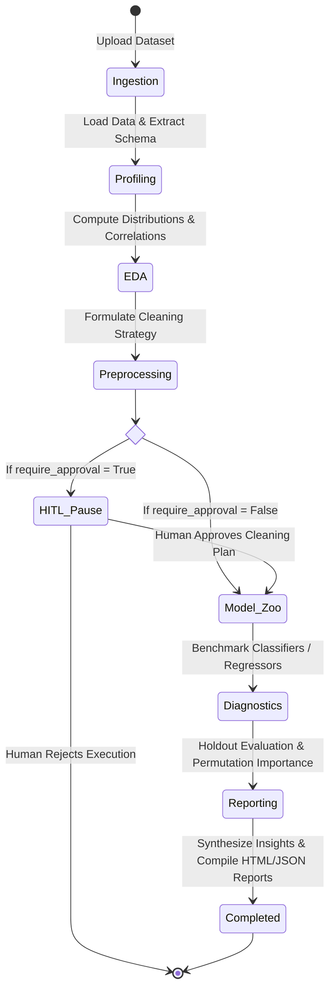

# AutoAnalyst AI — Technical Architecture & System Specifications

---

## 1. Executive Architecture Summary

**AutoAnalyst AI** is an enterprise-grade, full-stack multi-agent data analytics and machine learning platform. It replaces traditional rigid, sequential analytical pipelines with an **autonomous multi-agent topology** governed by LangGraph-compatible state transitions and supported by a **centralized OpenRouter LLM gateway** and **15 deterministic analytical tools**.

```text
┌─────────────────────────────────────────────────────────────────────────────────┐
│                          React 19 Cyber Dark Frontend                           │
│  (Command Center • Dataset Hub • Agent Studio • Deep Analytics • System Health) │
└────────────────────────────────────────┬────────────────────────────────────────┘
                                         │ REST API & Server-Sent Events (SSE)
┌────────────────────────────────────────▼────────────────────────────────────────┐
│                        FastAPI Enterprise Backend Engine                        │
│             (Async Uvicorn Router • SQLite Run Store • Storage Engine)          │
└────────────────────────────────────────┬────────────────────────────────────────┘
                                         │ Run Lifecycle Dispatch
┌────────────────────────────────────────▼────────────────────────────────────────┐
│                     Autonomous Multi-Agent Orchestrator                         │
│   (LangGraph State Machine • HITL Safety Governance • Event Stream Dispatcher)  │
├───────────────────┬──────────────────────────────────────────┬──────────────────┤
│ 🔍 ProfilingAgent │ 📈 EDAAgent           ⚙️ Preprocessing   │ 🤖 MLAgent       │
│ 🩺 EvalAgent      │ 📑 ReportingAgent     🛡️ Supervisor     │ 💬 AI Copilot    │
└───────────────────┴────────────────────┬─────────────────────┴──────────────────┘
                                         │ Tool Calls & Structured LLM Reasoning
┌────────────────────────────────────────┴────────────────────────────────────────┐
│                Centralized LLM Gateway & Deterministic Tool Engine               │
│                                                                                 │
│  [OpenRouter Provider] ──> Primary: GPT-4o-mini ──> Fallback: Claude-3.5-Haiku  │
│  [15 Deterministic Tools] ──> DataProfile, Cleaning, OneHot, ModelZoo, Metrics │
└─────────────────────────────────────────────────────────────────────────────────┘
```

---

## 2. Multi-Agent State Machine

The orchestration engine implements a structured state machine where agents execute sequentially or conditionally based on dataset properties and Human-In-The-Loop (HITL) approval gates.



### Agent Responsibilities & Decision Trees

#### 1. DataProfilingAgent
- **Input**: Raw uploaded dataframe (CSV, Parquet, or Excel).
- **Tool Invocations**: `ProfileDatasetTool`, `MissingnessReportTool`.
- **Output**: Total rows, total columns, column data types (`dtypes`), missing cell counts, duplicate row counts, and computed Health Score ($0.0 - 100.0\%$).
- **LLM Reasoning**: Analyzes schema anomalies, flag identifiers, and high-null columns.

#### 2. EDAAgent
- **Input**: Profiling metadata and raw dataframe.
- **Tool Invocations**: `DistributionAnalysisTool`, `CorrelationAnalysisTool`, `OutlierDetectionTool`.
- **Output**: Descriptive statistics (mean, median, standard deviation, skewness, quantiles), Pearson and Spearman correlation matrices, and multivariate outlier counts.
- **LLM Reasoning**: Interprets collinearity clusters and distribution skews.

#### 3. PreprocessingAgent
- **Input**: EDA results and column missingness reports.
- **Tool Invocations**: `GenerateTransformationPlanTool`, `ExecuteCleaningTool`, `EncodeFeaturesTool`.
- **Output**: Cleaned dataframe, median/mode imputation logs, duplicate row removal logs, one-hot encoded feature matrix, and high-cardinality protection warnings.
- **HITL Integration**: Emits `HITL_PAUSED` Server-Sent Event when human approval is required before irreversible data transformation or model training.

#### 4. MachineLearningAgent
- **Input**: Cleaned feature matrix, target column name, and task hint (`classification`, `regression`, or `auto`).
- **Tool Invocations**: `InferMLTaskTool`, `BenchmarkModelsTool`.
- **Output**: Stratified k-fold cross-validation leaderboard, trained candidate models (`RandomForest`, `GradientBoosting`, `Ridge`, `LogisticRegression`), and champion model artifact.
- **Auto-Correction**: Continuous numeric targets with high unique counts are automatically classified into regression models even if initially labeled as classification.

#### 5. EvaluationAgent
- **Input**: Trained champion model, holdout test features, and ground-truth target vector.
- **Tool Invocations**: `EvaluateModelTool`, `PermutationImportanceTool`.
- **Output**: Holdout performance metrics ($R^2$, RMSE, MAE for regression; Accuracy, Precision, Recall, F1, ROC-AUC for classification), confusion matrix, and top permutation feature drivers.

#### 6. ReportingAgent
- **Input**: Aggregated multi-agent run state, profile, model benchmarks, and holdout diagnostics.
- **Tool Invocations**: `CompileReportTool`, `DetectDriftTool`.
- **Output**: Executive strategy brief, categorized empirical findings, interactive Cyber Dark Chart.js HTML report, structured JSON artifact, and cleaned CSV dataset.

---

## 3. Centralized OpenRouter LLM Infrastructure

All LLM operations are routed through a unified, production-grade service layer (`src/autoanalyst/llm/`) with zero decentralized LLM instantiations:

```text
src/autoanalyst/llm/
├── provider.py        # LLMProvider protocol & OpenRouterProvider (httpx client with retries)
├── router.py          # ModelRouter (task-to-model mapping & fallback resolution)
├── tracker.py         # LLMUsageTracker (thread-safe token, latency, and cost telemetry)
├── context.py         # ContextBuilder (system instruction and structured prompt assembler)
├── service.py         # LLMService (high-level execution gateway with Pydantic validation)
└── types.py           # Structured message, token usage, and task enum types
```

### Cascading Fallback & Reliability Matrix
- **Primary Model**: `openai/gpt-4o-mini` (Fast, highly capable structured JSON generation).
- **Fallback Model**: `anthropic/claude-3.5-haiku` (High-reasoning secondary model invoked automatically on 429 rate limit, 404, or 5xx server errors).
- **Exponential Backoff**: Automatic retries on transient network errors (`429`, `500`, `502`, `503`, `504`) with jitter.
- **Deterministic Graceful Degradation**: If LLM gateway is unconfigured or exhausts credit limits, agents fall back to deterministic statistical syntheses without breaking the execution pipeline.

---

## 4. Database & Storage Architecture

AutoAnalyst AI utilizes SQLite with SQLAlchemy ORM for relational run history and on-disk file storage for dataset artifacts:

```text
uploads/               # Stored uploaded CSV/Parquet dataset files
reports/               # Compiled HTML, Markdown, and JSON executive reports
autoanalyst.db         # SQLite database storing datasets, runs, events, and chat logs
```

### Database Entities
- **`DatasetModel`**: `id`, `filename`, `file_path`, `file_size_bytes`, `file_format`, `rows`, `columns`, `health_score`, `created_at`.
- **`AnalysisRunModel`**: `id`, `dataset_id`, `target_column`, `model_task`, `status`, `champion_model_name`, `champion_score`, `executive_summary`, `insights_json`, `findings_json`, `profile_json`, `eda_json`, `model_results_json`, `evaluation_json`, `duration_ms`, `created_at`.
- **`ChatMessageModel`**: `id`, `analysis_id`, `role`, `content`, `timestamp`.

---

## 5. Security & Secret Management

1. **Zero Secret Leakage**: API keys and tokens are never returned via public endpoints (`/api/v1/system/config` or `/api/v1/system/llm/health`).
2. **Environment Variable Precedence**: Keys are read from `OPENROUTER_API_KEY` in `.env` or system environment.
3. **Pydantic Validation**: All incoming requests and LLM outputs are validated against strict Pydantic schemas.
