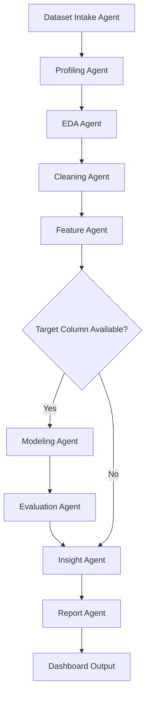

# LangChain and LangGraph Agentic Architecture Plan

## Objective

Extend AutoAnalyst AI into a professional agentic analytics system. The system should coordinate multiple specialized agents that transform a raw dataset into a useful analytical report.

## Design Principles

- Keep deterministic Python functions as the core engine.
- Use LangGraph for workflow orchestration and state transitions.
- Use LangChain for tools, prompt templates, model abstraction, and optional LLM calls.
- Make LLM usage optional so the project can run without API keys.
- Never commit API keys or secrets.
- Keep the workflow testable with sample data and fake/stub LLM responses.

## Proposed Agents

| Agent | Responsibility | Inputs | Outputs |
|---|---|---|---|
| Dataset Intake Agent | Validate uploaded dataset and metadata | File path/uploaded file | Loaded DataFrame, metadata |
| Profiling Agent | Generate basic data profile | DataFrame | Profile dictionary/report |
| EDA Agent | Run summaries and correlations | DataFrame | EDA tables/charts |
| Cleaning Agent | Recommend/apply cleaning steps | DataFrame, profile | Cleaned DataFrame, cleaning log |
| Feature Agent | Create features for analysis/modeling | Cleaned DataFrame | Feature DataFrame |
| Modeling Agent | Train baseline models if target exists | Feature DataFrame, target | Model results |
| Evaluation Agent | Evaluate predictions | y_true, y_pred | Metrics |
| Insight Agent | Generate readable findings | Profile, EDA, metrics | Insight list |
| Report Agent | Build final Markdown/HTML report | Insights, tables, charts | Report file |
| Supervisor Agent | Route workflow and handle failures | Graph state | Next node decision |

## Suggested LangGraph State

```python
from typing import Any, TypedDict

import pandas as pd


class AutoAnalystState(TypedDict, total=False):
    dataset_path: str
    df: pd.DataFrame
    cleaned_df: pd.DataFrame
    target_column: str
    profile: dict[str, Any]
    eda_results: dict[str, Any]
    cleaning_log: list[str]
    feature_columns: list[str]
    model_results: dict[str, Any]
    evaluation_results: dict[str, Any]
    insights: list[str]
    report_path: str
    errors: list[str]
```

## Proposed Graph Flow



## Suggested Folder Structure for Agentic Layer

```text
src/autoanalyst/agents/
├── __init__.py
├── state.py
├── graph.py
├── tools.py
├── prompts.py
├── supervisor.py
├── dataset_intake_agent.py
├── profiling_agent.py
├── eda_agent.py
├── cleaning_agent.py
├── feature_agent.py
├── modeling_agent.py
├── evaluation_agent.py
├── insight_agent.py
└── report_agent.py
```

## Implementation Phases

### Phase A - Deterministic Tool Layer

Create LangChain-compatible tools wrapping current project functions:

- `load_dataset_tool`
- `profile_dataset_tool`
- `summarize_numeric_columns_tool`
- `clean_missing_values_tool`
- `generate_insights_tool`
- `create_report_tool`

### Phase B - LangGraph State Machine

Build a graph with deterministic nodes first. Avoid LLM calls until the state flow is stable.

### Phase C - Optional LLM Insight Writer

Add optional LLM-powered narrative insights behind environment variables.

Rules:

- Do not hardcode model keys.
- Read keys only from `.env` or environment variables.
- Keep fallback rule-based insights.

### Phase D - Dashboard Integration

Allow Streamlit to run the graph and display state outputs.

## Quality Requirements

- Every graph node should handle errors and append messages to `state["errors"]`.
- The graph should support datasets without a target column.
- The graph should work on `data/sample/example.csv`.
- Tests should verify at least one full dry-run path.
