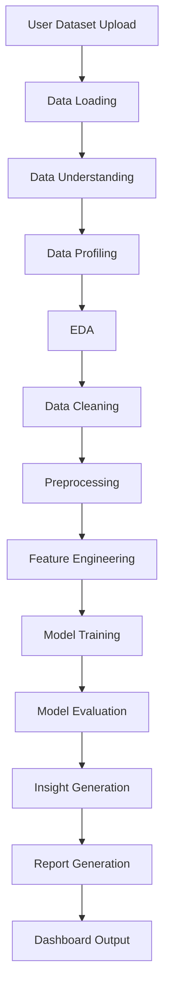

# End-to-End Integration Strategy

## Purpose

AutoAnalyst AI is an integrated system, not a collection of disconnected modules. Every team contribution should connect to the central workflow that starts with a user dataset and ends with dashboard-ready outputs.

## Full System Workflow



## Central Pipeline File

The central integration layer is:

```text
src/autoanalyst/pipeline.py
```

The dashboard, future CLI, and future LangChain/LangGraph agents should call this pipeline instead of duplicating business logic.

## Input / Output Contracts

### 1. Dataset Input Contract

Accepted input:

- CSV file path
- Excel file path
- pandas DataFrame

Main function:

```python
run_analysis_pipeline(dataset, config)
```

### 2. Pipeline Configuration Contract

Configuration object:

```python
PipelineConfig(
    target_column=None,
    model_task="auto",
    missing_strategy="median",
    encode_categoricals=True,
    model_test_size=0.2,
    random_state=42,
    report_path=None,
)
```

### 3. Pipeline Result Contract

The pipeline returns `PipelineResult` with:

| Field | Type | Purpose |
|---|---|---|
| `raw_df` | DataFrame | Original loaded data |
| `cleaned_df` | DataFrame | Data after duplicate and missing-value handling |
| `model_ready_df` | DataFrame | Encoded/model-ready data |
| `profile` | dict | Dataset profile summary |
| `missing_values_report` | DataFrame | Missing values by column |
| `eda_results` | dict | Numeric summary and correlation matrix where available |
| `insights` | list[str] | Human-readable findings |
| `model_results` | dict or None | Baseline model metadata |
| `evaluation_results` | dict or None | Model metrics |
| `report_path` | Path or None | Generated report path if configured |
| `warnings` | list[str] | Non-fatal pipeline warnings |

## Team Integration Responsibilities

| Team | Integration Responsibility |
|---|---|
| Team 1: Project Management & GitHub | Ensure PRs explain how changes connect to the pipeline |
| Team 2: Data Understanding & Profiling | Keep profiling outputs compatible with `PipelineResult.profile` |
| Team 3: EDA & Visualization | Return reusable EDA outputs that can be added to `eda_results` |
| Team 4: Preprocessing & Feature Engineering | Keep cleaning/feature functions deterministic and pipeline-safe |
| Team 5: Machine Learning | Expose model functions that accept `model_ready_df`, features, and target |
| Team 6: Evaluation & Insights | Keep metrics and insights structured for reports/dashboard |
| Team 7: Reporting & Dashboard | Call `run_analysis_pipeline`; do not duplicate core analysis logic |

## Dashboard Integration Rule

The dashboard should be a presentation layer. It should:

1. Accept user input.
2. Build a `PipelineConfig`.
3. Call `run_analysis_pipeline`.
4. Display `PipelineResult` fields.

The dashboard should not reimplement profiling, cleaning, EDA, modeling, or reporting logic.

## Testing Strategy

Integration tests live in:

```text
tests/test_end_to_end_pipeline.py
```

Required checks:

- Pipeline runs on a sample DataFrame.
- Pipeline returns profile, cleaned data, EDA results, insights, and optional report.
- Pipeline supports a classification target.
- Future teams should add tests for regression, dashboard integration, and edge cases.

## Definition of Done for New Features

A feature is integration-ready when:

- It has a clear input and output.
- It does not depend on hardcoded local paths.
- It can be called from `src/autoanalyst/pipeline.py`.
- It has tests or manual verification notes.
- Its PR explains where it fits in the end-to-end workflow.
