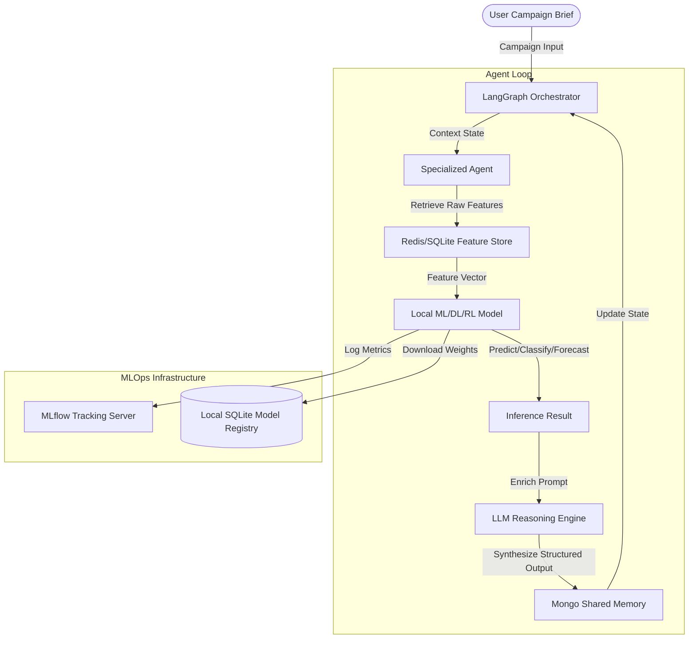
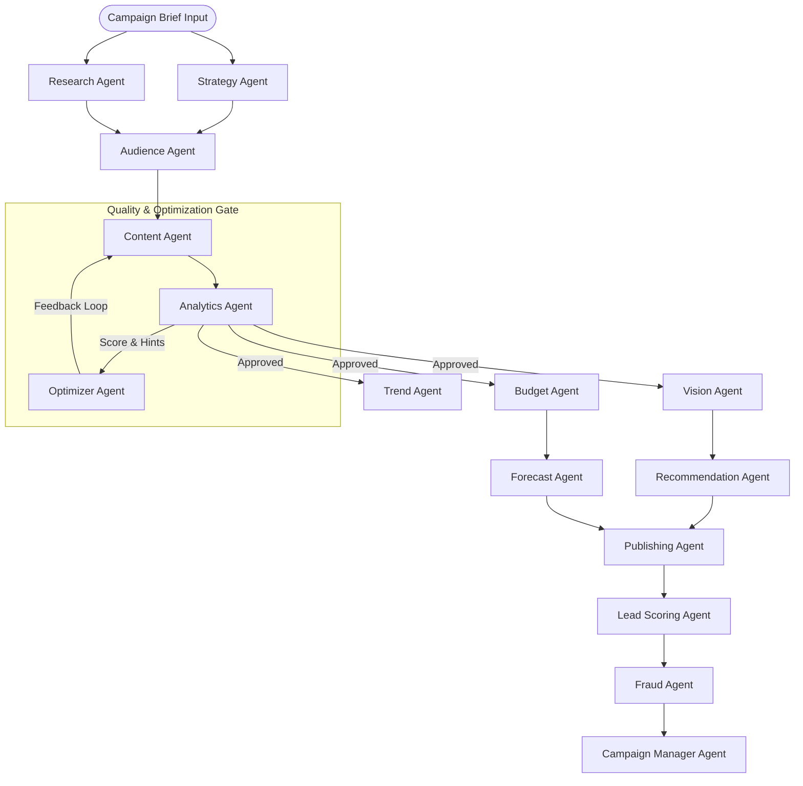
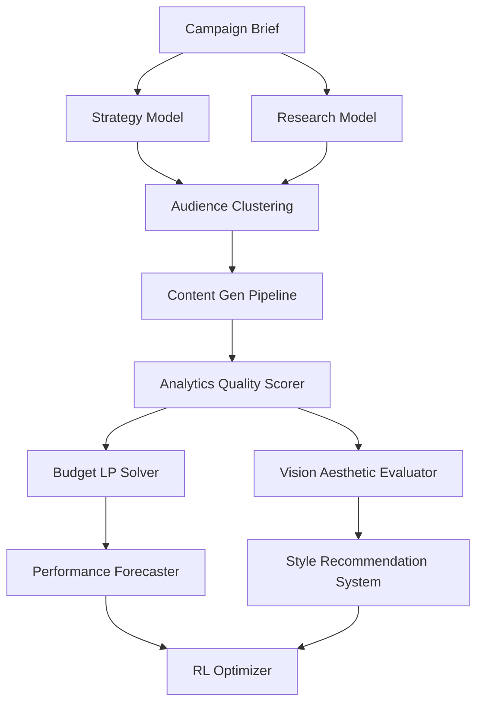

# AdPilot Pro – ML System Architecture & Agent Interaction

This document defines the high-level system architecture, agent interaction patterns, and dependency maps for the integrated Machine Learning layer of AdPilot Pro.

---

## 🏗️ 1. Core ML System Architecture

AdPilot Pro integrates a hybrid intelligence architecture where **LangGraph Orchestration**, **Specialized ML Models**, and **LLM Reasoning Engine** coordinate sequentially to ensure high-fidelity, data-driven outputs.

---

## 🔄 2. Agent Interaction & Data Flow Diagram

The campaign execution follows a directed acyclic graph (DAG) where downstream agents consume both the structural outputs and raw predictions of upstream agents.

---

## 📊 3. Specialized ML Task Mapping

Below is the mapping of each of the 15 specialized agents to their corresponding ML task type and proposed core framework (specific hyperparameters and custom architectures will be detailed in Phase 4).

| Agent Name | ML Task Type | General Framework | Purpose in Pipeline |
| :--- | :--- | :--- | :--- |
| **Strategy Agent** | Multi-Label Classification | Scikit-learn / LightGBM | Predicts optimal marketing channels and positioning tactics. |
| **Audience Agent** | Clustering & Persona Segmenting | Scikit-learn (K-Means/HDBSCAN) | Group target audience demographic vectors into distinct cohorts. |
| **Research Agent** | Semantic Search & Information Extraction | PyTorch / Transformers / Sentence-BERT | Extracts competitor features and target market insights from documents. |
| **Content Agent** | Text Generation & Fine-Tuning | HuggingFace PEFT / LoRA | Generates high-converting copywriting tailored to brand guidelines. |
| **Analytics Agent** | Regressor / Quality Scorer | LightGBM / XGBoost | Predicts health scores and conversion probability for campaign copies. |
| **Budget Agent** | Constrained Optimization (Linear Programming) | SciPy Optimize / PuLP | Allocates budget across channels to maximize predicted ROAS. |
| **Trend Agent** | Time-Series Forecasting | Statsmodels / Prophet | Identifies seasonal market opportunities and budget multipliers. |
| **Recommendation Agent** | Collaborative Filtering / Content-Based | LightFM / Scikit-learn | Recommends high-performing ad sizes, CTAs, and layout styles. |
| **Forecast Agent** | Regression / Time-Series | XGBoost / Prophet | Forecasts campaign impressions, clicks, and conversion curves over time. |
| **Fraud Agent** | Anomaly Detection | Scikit-learn (Isolation Forest) | Detects fake leads or click-fraud patterns in incoming telemetry data. |
| **Lead Scoring Agent** | Binary Classification | XGBoost / CatBoost | Scores lead conversion probability based on interactive telemetry. |
| **Sentiment Agent** | Sequence Classification | Transformers / RoBERTa | Analyzes sentiment polarity of audience comments and feedback. |
| **Vision Agent** | Image Classification & Aesthetics Scorer | PyTorch / CLIP | Evaluates visual layout suitability and aesthetic appeal of creatives. |
| **Knowledge Agent** | Dense Passage Retrieval / RAG | Qdrant / Sentence-Transformers | Fetches campaign-specific context and brand assets. |
| **Optimizer Agent** | Reinforcement Learning | Stable-Baselines3 (PPO) | Dynamically fine-tunes bids and copy variants based on performance. |

---

## 🛡️ 4. System Dependency Diagram

This diagram displays the strict dependency chain showing how models rely on upstream outputs.

