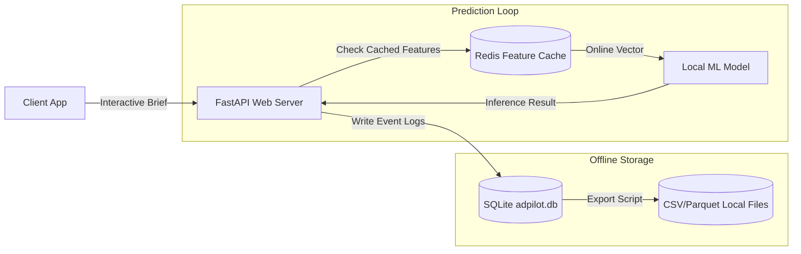
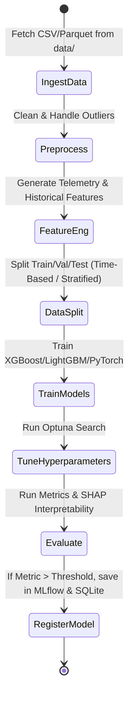
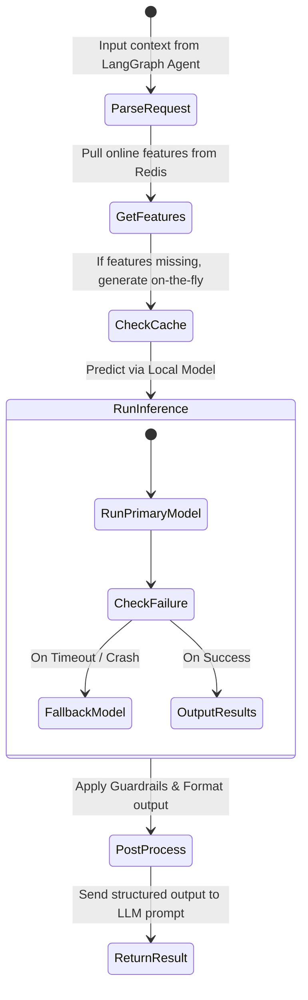

# AdPilot Pro – Data Flow & Pipeline Design

This document details the telemetry ingestion, training loop, and online inference pipeline for the AdPilot Pro ML subsystem.

---

## 💾 1. Data Flow Diagram

The diagram below displays the telemetry and inference flow. Online predictions utilize Redis to fetch pre-computed features, while offline logs are asynchronously sent to the SQLite DB and file system to build datasets for retraining.

---

## ⚙️ 2. Training Pipeline Design

The training pipeline runs asynchronously to ingest raw datasets, perform feature engineering, select baseline/candidate models, validate performance, and register models locally.

### Components of the Training Pipeline:
1. **Batch Ingestion**: Scraped ad history, audience profiles, and telemetry events are loaded from the `./data/` folders.
2. **Preprocessing**: Missing values are imputed, category variables are one-hot encoded, and numerical fields are scaled.
3. **Data Splitting**: 
   * *Time-Series/Forecast Models*: Strict chronological splitting (e.g., first 80% of time steps for training, last 20% for test) to prevent temporal data leakage.
   * *Classification/Clustering Models*: Stratified splits to maintain label proportions.
4. **Model Tuning & Evaluation**: Candidate architectures are trained and compared. Best-performing weights/parameters are sent to the local Model Registry.

---

## ⚡ 3. Inference Pipeline Design

The inference pipeline handles real-time requests from the LangGraph agents. It is optimized for low latency and utilizes fallback models if specialized ML inference fails.

### Key Elements of the Inference Pipeline:
* **Online Feature Retrieval**: High-speed lookup of historical audience behavior and budget coefficients using Redis hashes.
* **Fallbacks**: If a specialized ML model crashes or fails validation, the system falls back to a deterministic rules-based model or a simplified linear regressor to preserve stability.
* **Structured Post-processing**: The raw prediction float or vector is converted into Pydantic models (e.g., `StrategyAgentOutput`), ensuring strict JSON formatting before ingestion by the LLM reasoning agent.
