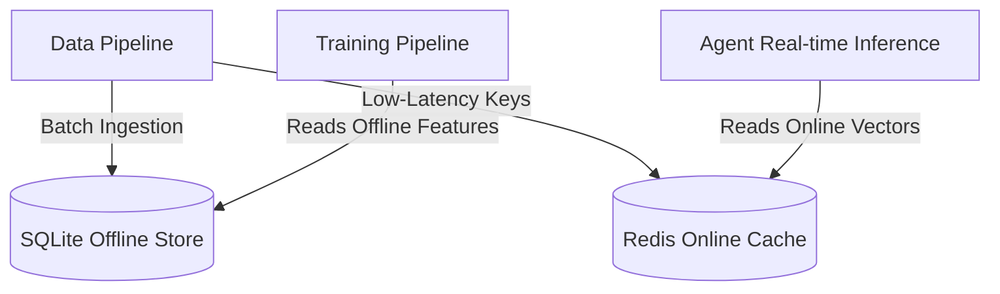
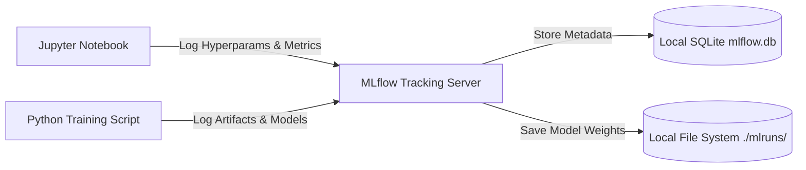
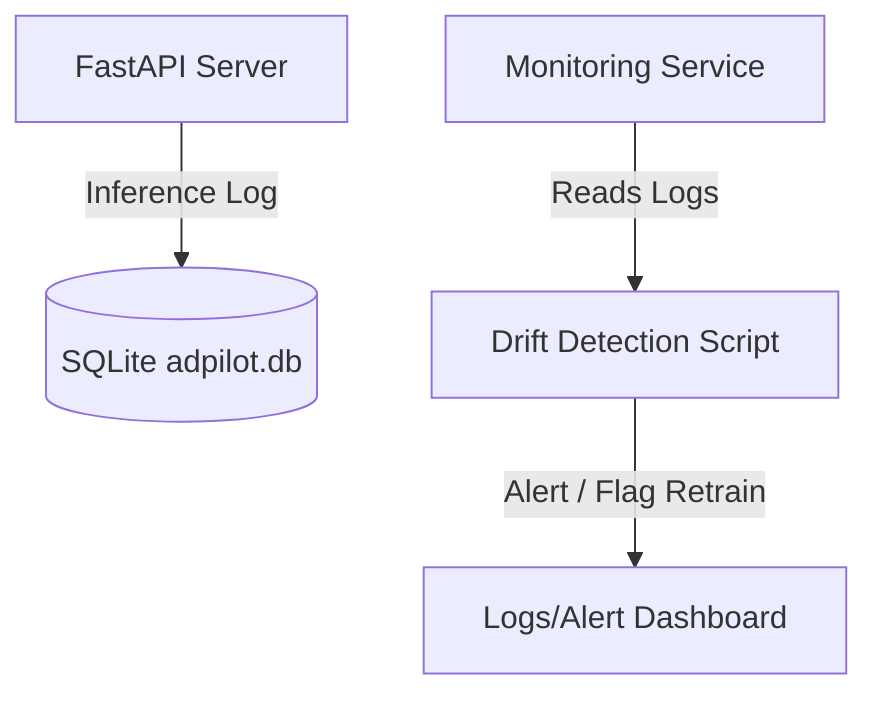

# AdPilot Pro – MLOps Platform Design

This document details the architecture for the local MLOps stack, including the feature store, model registry, experiment tracker, and telemetry monitoring system.

---

## 🏬 1. Feature Store Design

To prevent training-serving skew, AdPilot Pro uses a dual-database local feature store:

### 1.1 Online Feature Store (Redis)
* **Storage Pattern**: Key-value hashes mapped by campaign IDs and segment targets.
* **Write Mechanism**: Updated periodically by background cron tasks or directly upon campaign submission.
* **Key Format**: `ap_feat:<entity>:<id>` (e.g., `ap_feat:audience:tech_enthusiasts` storing average CTR and CPM features).

### 1.2 Offline Feature Store (SQLite / Parquet)
* **Storage Pattern**: Historic tabular data stored in local files (`data/processed/`) and sqlite databases (`adpilot.db`).
* **Attributes**: Timestamped features used to generate training datasets without data leakage.

---

## 🗃️ 2. Model Registry & Experiment Tracking

AdPilot Pro utilizes **MLflow** running locally for experiment tracking and model registration.

### 2.1 Configuration Strategy
* **MLflow Tracking URI**: `sqlite:///mlflow.db` (a local SQLite DB in the root directory).
* **Artifact Directory**: `./mlruns/` (local folder containing saved weights, model cards, and SHAP outputs).
* **Model Versioning**: Model names follow strict naming conventions (e.g., `strategy_model`, `analytics_scorer`). Releases are tagged using standard aliases: `Staging`, `Production`, or `Archived`.

---

## 📈 3. Monitoring & Drift Detection Strategy

To ensure model health, the platform captures all predictions and inputs into a local database and regularly tests for drift.

### 3.1 Metrics Logged:
For every prediction run, the system writes the following metadata to the DB:
* `timestamp`, `agent_id`, `model_name`, `model_version`, `input_feature_vector`, `predicted_outputs`, and `actual_kpi_feedback` (when campaign results arrive).

### 3.2 Drift & Health Checks:
1. **Data Quality Checks**: Monitor missing value ratios and unexpected data types in the inference request.
2. **Data Drift (KS-Test)**: Run Kolmogorov-Smirnov statistical tests on numerical features to verify if the serving data distribution has drifted from training datasets.
3. **Model Performance Drift**: Track the accuracy/RMSE of models over time by comparing historical predictions with actual campaign performance telemetry.
