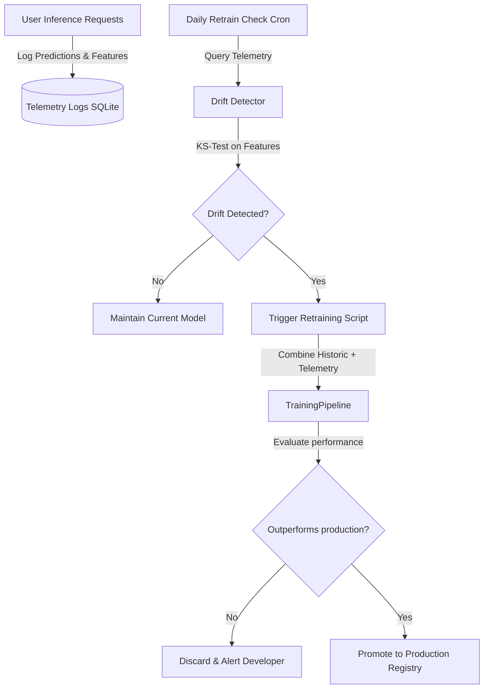

# AdPilot Pro – Enterprise CI/CD & MLOps Pipeline

This document establishes the continuous integration, continuous delivery, and monitoring automation loops for the AdPilot Pro Machine Learning subsystem.

---

## 🔁 1. Continuous Ingestion & Retraining Loop

Model performance degrades over time due to shifts in user behavior, market trends, and seasonal changes. AdPilot Pro automates retraining via data drift checks:

---

## 🧪 2. CI/CD Integration & Promotion Gates

Every code change or scheduled retrain executes automated checks before promoting a model version to the active serving environment.

### 2.1 Model Registry Versioning
All model builds are tracked in the local **MLflow registry** with semantic tags:
* **`Staging`**: Candidate models that have passed offline evaluation.
* **`Production`**: The active model in service.

### 2.2 Automation Workflow Steps:
1. **Model Fit**: `TrainingPipeline` fits the new candidate.
2. **Offline Evaluation**: The model score (e.g., F1 or MAE) is calculated on a held-out test split.
3. **Registry Gate**: 
   * If `New_Model_Metric > Production_Model_Metric`, the new version is registered and tagged as `Staging`.
   * Otherwise, the run is archived and a notification is logged.
4. **Integration Testing**: A test script spins up a temporary FastAPI instance and runs dummy inference against the `Staging` model.
5. **Promotion**: If the integration test passes, the `Staging` model tag is updated to `Production`, and the old production model is tagged as `Archived`.

---

## 📈 3. Data & Model Drift Monitoring

Feature distributions are monitored using **Kolmogorov-Smirnov (KS) tests**.

* **KS Test Null Hypothesis (\(H_0\))**: The baseline feature distribution (used during training) and the serving feature distribution (received at inference) are identical.
* **Drift Threshold**: If the statistical test yields a p-value \(p < 0.05\), we reject \(H_0\) and flag the feature as drifted, triggering retraining.
* **Implementation**: Managed programmatically by `DriftDetector` under `ml/monitoring/drift_detector.py`.
