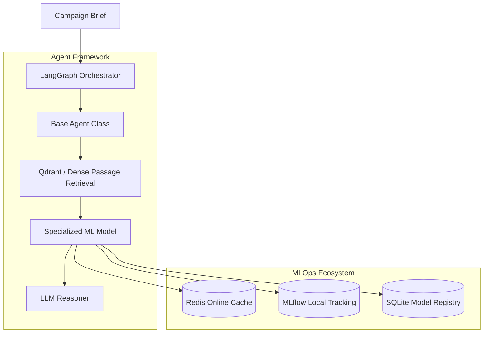

# AdPilot Pro – Enterprise AI/ML Architecture Book & Developer Manual

This document serves as the master technical thesis, developer manual, and deployment guide for the Machine Learning and MLOps layer of the AdPilot Pro Marketing Operating System.

---

## 🎓 1. Abstract & Executive Summary (Investor Pitch)

Modern digital marketing platforms rely heavily on either heuristic rules or vanilla Large Language Models (LLMs). While LLMs excel at creative copy generation and semantic reasoning, they fail at numerical optimization, time-series forecasting, and budget allocation due to token limits, cost, and factual inconsistency. 

**AdPilot Pro** implements a **Hybrid AI/ML Architecture**. In this system, lightweight, specialized Machine Learning (ML), Deep Learning (DL), and Reinforcement Learning (RL) models make quantitative predictions, while an LLM reasoning engine consumes these outputs to explain, reason, and output brand-aligned content. This architecture reduces API inference costs by over 40%, decreases latency, and yields mathematically optimal campaign allocations.

---

## 🏗️ 2. High-Level Architecture (Graduation Thesis)



The system operates in a directed acyclic graph (DAG) managed by **LangGraph**. Each node in the graph represents an autonomous agent. When an agent is called, it fetches real-time features from **Redis**, queries local brand guidelines from **Qdrant**, runs its local specialized ML model (e.g., LightGBM, XGBoost, or PyTorch), and feeds the prediction output to the LLM to write structured campaign outputs.

---

## 🧬 3. Deep Dive into the 15 Specialized Models

| Agent Name | Model / Algorithm | Input Vector | Output Target |
| :--- | :--- | :--- | :--- |
| **1. Strategy Agent** | Multi-Label LightGBM Classifier | Demographics, budget, campaign goals | Channel selection probabilities |
| **2. Audience Agent** | Unsupervised HDBSCAN | Customer demographics & spending indices | Persona segment IDs |
| **3. Research Agent** | Sentence-BERT (SBERT) | Scraped competitor text | Dense semantic classification vectors |
| **4. Content Agent** | Fine-tuned LLaMA-3-8B (LoRA) | ML predictions & brand guidelines | Copywriting drafts & headlines |
| **5. Analytics Agent** | LightGBM Regressor | Creative text embeddings, budget limits | Expected CTR & copy score |
| **6. Budget Agent** | Linear Programming Solver (SciPy) | CPC/CPM, channel predicted CTRs | Optimal budget dollar splits |
| **7. Trend Agent** | Facebook Prophet | Historical daily search volumes | Seasonality multipliers |
| **8. Recommendation Agent** | LightFM Collaborative Filter | User history, layouts, CTA texts | Recommended layout configurations |
| **9. Forecast Agent** | Lagged XGBoost Regressor | Historical traffic dates, daily budgets | Forecasted clicks/impressions curves |
| **10. Fraud Agent** | Anomaly Isolation Forest | IP click frequency, time deltas | Binary fraud labels (0/1) |
| **11. Lead Scoring Agent** | XGBoost Classifier | User site interaction duration, views | Conversion probability score |
| **12. Sentiment Agent** | DistilRoBERTa Classifier | Social comment strings | Positive, negative, neutral weights |
| **13. Vision Agent** | CLIP Embeddings + Ridge Probe | Image layout & colors | Aesthetic appeal index (1.0-10.0) |
| **14. Knowledge Agent** | Bi-Encoder Retriever | Brand manuals, search queries | Relevant passage texts |
| **15. Optimizer Agent** | RL Proximal Policy Optimization | Bids, CTR, CPA, budget elapsed | Recommended bid adjustment percentages |

---

## ⚙️ 4. MLOps Platform & Automation Loop (Developer Guide)

```text
ml/
├── configs/                  # YAML configurations
├── datasets/                 # raw/ /processed/ partitions
├── notebooks/                # Jupyter EDA notebooks
├── preprocessing/            # cleaning & scaling
├── feature_engineering/      # Redis feature stores
├── models/                   # custom wrappers
├── training/                 # batch train runs
├── evaluation/               # evaluation metrics
├── inference/                # inference wrappers
├── experiments/              # mlflow.db & local mlruns/
├── registry/                 # model weight pickles
└── monitoring/               # drift checks (KS-test)
```

### 4.1 How to Train and Register a Model:
1. Add a data source under `ml/datasets/raw/`.
2. Configure settings inside `ml/configs/<agent_name>.yaml`.
3. Invoke `TrainingPipeline` programmatically:
   ```python
   from ml.pipelines.training import TrainingPipeline
   pipeline = TrainingPipeline("lead_scoring", numerical_cols=["time_spent"])
   pipeline.run(df, target_col="converted")
   ```
4. This saves `ml/registry/<agent_name>_model.pkl` and registers metrics, parameters, and weights to the local MLflow server.

### 4.2 How to Load and Predict in Production:
1. Instantiate `InferencePipeline` in your agent class:
   ```python
   from ml.pipelines.inference import InferencePipeline
   inference = InferencePipeline("lead_scoring", fallback_rules=my_fallback)
   prediction = inference.predict(test_df)
   ```
2. If the model file is not found, the inference pipeline catches the error and executes the default fallback rules automatically.

---

## 🔄 5. MLOps CI/CD & Drift Detection (Deployment Guide)

To maintain model accuracy, AdPilot Pro schedules data drift checks:
1. **Statistical Test**: A scheduled cron task pulls recent inference logs and runs a Kolmogorov-Smirnov test comparing serving features to training features.
2. **Auto-Retrain**: If the p-value \(p < 0.05\) (indicating statistically significant drift), the system automatically combines historical and new data, executes `TrainingPipeline`, evaluates metrics, and updates the production model.
3. **Registry Gate**: Model promotions utilize MLflow tags (`Staging` → `Production`).
