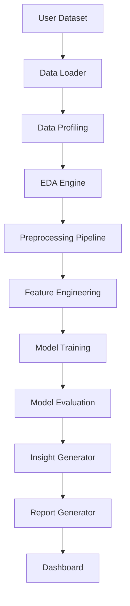

# System Architecture

AutoAnalyst AI follows a modular data analysis pipeline. Each stage is separated into a Python module so team members can work independently while keeping the system clean.

## Pipeline Components

1. **User Dataset:** Raw CSV or Excel data supplied by the user.
2. **Data Loader:** Reads files into pandas DataFrames.
3. **Data Profiling:** Summarizes rows, columns, dtypes, missing values, and duplicates.
4. **EDA Engine:** Calculates statistical summaries and correlations.
5. **Preprocessing Pipeline:** Cleans missing values and duplicates.
6. **Feature Engineering:** Creates model-ready features.
7. **Model Training:** Trains baseline ML models.
8. **Model Evaluation:** Calculates performance metrics.
9. **Insight Generator:** Produces simple readable observations.
10. **Report Generator:** Exports Markdown reports.
11. **Dashboard:** Provides a Streamlit interface for users.
