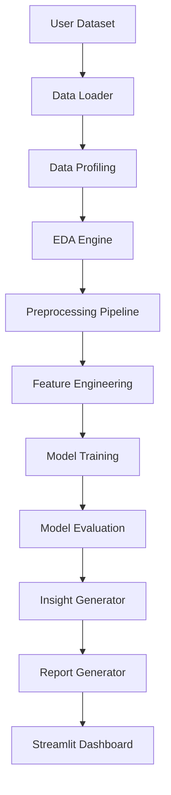
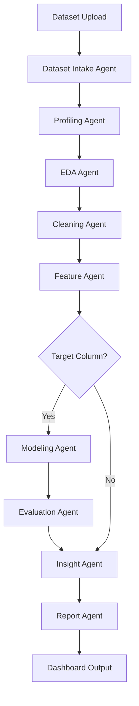

# System Architecture

AutoAnalyst AI follows a modular analytics pipeline with an optional agentic orchestration layer.

## Current Modular Pipeline



## Future Agentic Pipeline



## Main Components

1. **Data Loader**: Reads CSV/Excel files into pandas DataFrames.
2. **Data Profiling**: Summarizes shape, dtypes, missing values, duplicates, and column-level quality.
3. **EDA Engine**: Produces summaries, correlations, and charts.
4. **Preprocessing Pipeline**: Handles duplicates, missing values, and data preparation.
5. **Feature Engineering**: Creates encoded and datetime-derived features.
6. **Modeling**: Trains baseline classification and regression models.
7. **Evaluation**: Calculates ML metrics.
8. **Insight Generator**: Produces readable observations.
9. **Report Generator**: Exports Markdown reports.
10. **Streamlit Dashboard**: User-facing interface.
11. **Optional Future Orchestration Layer**: Future extension point for agentic or automated workflow orchestration after the core team deliverables are complete.

## Optional Future Orchestration Package

If the project later adds an agentic workflow, keep it isolated from the deterministic analytics modules:

```text
src/autoanalyst/agents/
```

This future layer should call the tested pipeline functions instead of replacing them.

## Architecture Rule

Keep the core analytics functions deterministic and testable. Agents should orchestrate these functions, not replace them with unclear logic.
