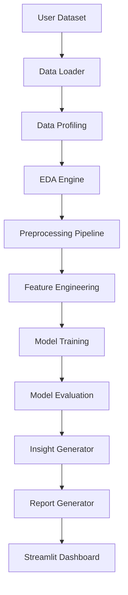
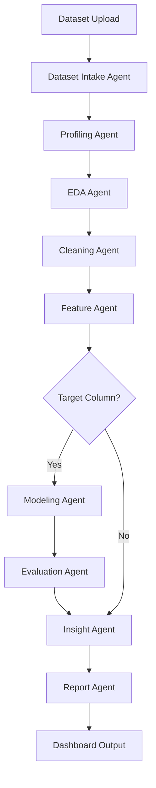

# System Architecture

AutoAnalyst AI follows a modular analytics pipeline with an optional agentic orchestration layer.

## Current Modular Pipeline



## Future Agentic Pipeline



## Main Components

1. **Data Loader**: Reads CSV/Excel files into pandas DataFrames.
2. **Data Profiling**: Summarizes shape, dtypes, missing values, duplicates, and column-level quality.
3. **EDA Engine**: Produces summaries, correlations, and charts.
4. **Preprocessing Pipeline**: Handles duplicates, missing values, and data preparation.
5. **Feature Engineering**: Creates encoded and datetime-derived features.
6. **Modeling**: Trains baseline classification and regression models.
7. **Evaluation**: Calculates ML metrics.
8. **Insight Generator**: Produces readable observations.
9. **Report Generator**: Exports Markdown reports.
10. **Streamlit Dashboard**: User-facing interface.
11. **LangChain/LangGraph Agents**: Optional orchestration layer for a professional multi-agent workflow.

## Suggested Agent Package

```text
src/autoanalyst/agents/
├── state.py
├── graph.py
├── tools.py
├── prompts.py
├── supervisor.py
├── dataset_intake_agent.py
├── profiling_agent.py
├── eda_agent.py
├── cleaning_agent.py
├── feature_agent.py
├── modeling_agent.py
├── evaluation_agent.py
├── insight_agent.py
└── report_agent.py
```

## Architecture Rule

Keep the core analytics functions deterministic and testable. Agents should orchestrate these functions, not replace them with unclear logic.
