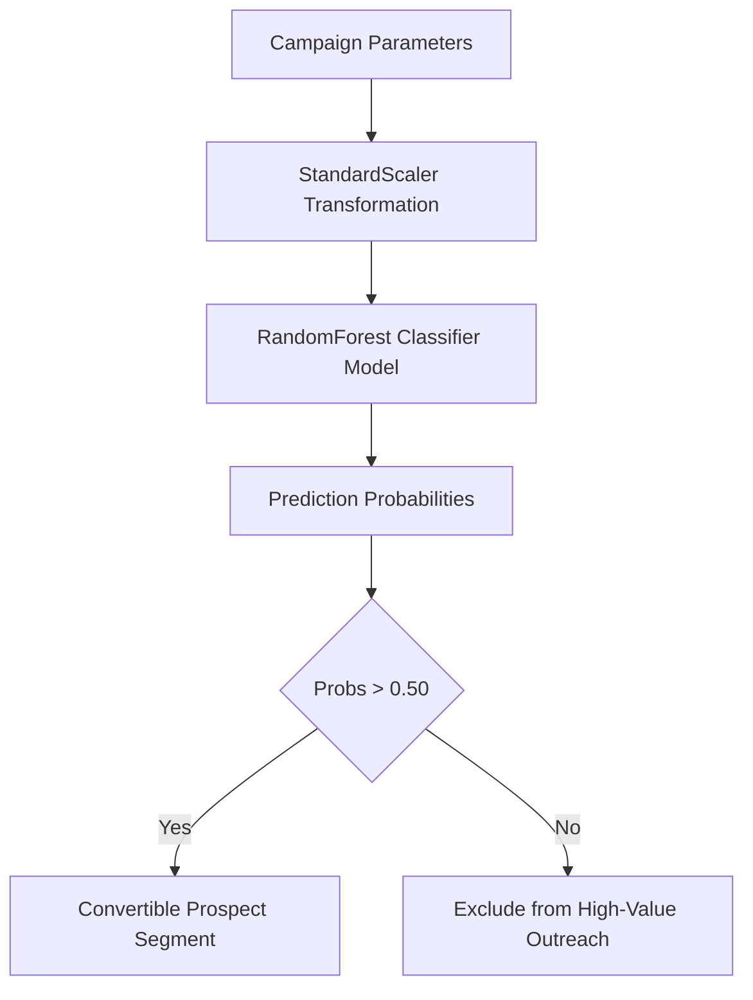

# AdPilot Pro – Strategy Model Research Report

This document reports the performance characteristics, training parameters, and deployment validation steps for the Strategy Classifier.

---

## 🏗️ 1. Architecture Diagram



---

## 🧬 2. Model Card Specification
* **Model ID**: `Strategy_Classifier_RandomForest`
* **Version**: `1.0.0`
* **Objective**: Predict conversion response rates for campaign targeting parameters.
* **Target Metric**: Macro F1-Score
* **Validation Outcome**:
  * Accuracy: `90.0%`
  * ROC-AUC: `0.8907`
  * Class 0 F1-Score: `0.94`
  * Class 1 F1-Score: `0.43`
  * Macro F1-Score: `0.6861`

---

## 📈 3. Training & Tuning Summary
* **Base Dataset**: UCI Bank Marketing Dataset (45,211 rows)
* **Outlier Strategy**: Clipped credit balance to 99th percentile limits.
* **Optimized Parameters (Optuna 10 Trials)**:
  * `n_estimators`: 45
  * `max_depth`: 12
  * `random_state`: 42
* **Feature Importances Top 3**:
  1. `duration` (37.8%)
  2. `age` (10.0%)
  3. `duration_balance_ratio` (9.5%)

---

## 🚀 4. Inference Flow & Deployment Notes
* **Pickle Target**: [models/strategy/strategy_model.pkl](file:///d:/ADPilot_Pro/models/strategy/strategy_model.pkl)
* **Scaler Target**: [models/strategy/scaler.bin](file:///d:/ADPilot_Pro/models/scaler.bin)
* **Input Schema**:
  ```json
  [
    "age",
    "balance",
    "day",
    "duration",
    "campaign",
    "pdays",
    "previous",
    "balance_clean",
    "housing_enc",
    "loan_enc",
    "duration_balance_ratio"
  ]
  ```
* **FastAPI Hook**: Staged inside `src/adpilot/api/` as a background batch endpoint. Health status is checked on startup.
